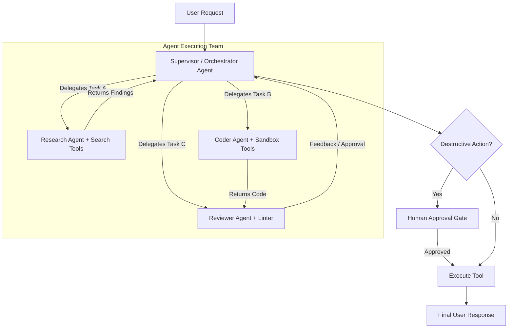

## Use this skill when

- Designing and implementing multi-agent AI systems, autonomous workers, or conversational agents.
- Building stateful cyclic agent workflows using **LangGraph** (StateGraph, conditional edges, checkpointing).
- Orchestrating collaborative multi-role teams with **CrewAI** (hierarchical processes, manager agents, tool delegation).
- Implementing structured Tool/Function Calling with Pydantic or Zod validation schemas.
- Designing multi-tiered agent memory (short-term conversational buffers, episodic memories, and semantic vector retrieval).
- Implementing safety guardrails, recursion limits, and human-in-the-loop (HITL) approval gates.

## Do not use this skill when

- The task is simple one-shot prompt engineering without tools, state, or agent loops.
- Standard machine learning model training without LLM agent orchestration.

## Instructions

- Never give agents unbounded loops; always enforce a strict `recursion_limit` or max iteration guardrail.
- Require deterministic **Human-in-the-Loop** approval before executing destructive actions (e.g., payments, database deletions, external emails).
- Use typed state definitions for state machines to ensure predictable transitions across agent nodes.

---

## 1. Multi-Agent Architectural Patterns



---

## 2. Stateful Agent Graph with LangGraph (Python)

LangGraph enables cyclical, state-driven multi-agent workflows with persistence:

```python
from typing import Annotated, TypedDict, Sequence
from langchain_core.messages import BaseMessage, HumanMessage
from langgraph.graph import StateGraph, END
from langgraph.graph.message import add_messages
from langgraph.prebuilt import ToolNode

# 1. Define State
class AgentState(TypedDict):
    messages: Annotated[Sequence[BaseMessage], add_messages]
    next_step: str

# 2. Define Decision Router
def route_model_output(state: AgentState):
    last_message = state["messages"][-1]
    if hasattr(last_message, "tool_calls") and len(last_message.tool_calls) > 0:
        return "tools"
    return END

# 3. Assemble Graph
workflow = StateGraph(AgentState)
workflow.add_node("agent", call_model_node)
workflow.add_node("tools", ToolNode(tools=[web_search, execute_query]))

workflow.set_entry_point("agent")
workflow.add_conditional_edges("agent", route_model_output, {
    "tools": "tools",
    END: END
})
workflow.add_edge("tools", "agent")

# Compile with checkpointing for state persistence & time-travel
app = workflow.compile(checkpointer=MemorySaver())
```

---

## 3. Collaborative Role Orchestration with CrewAI

Assign specific personas, backstories, and goal-driven tasks:

```python
from crewai import Agent, Task, Crew, Process
from crewai_tools import SerperDevTool

search_tool = SerperDevTool()

# Define Specialized Agents
researcher = Agent(
    role="Senior Market Intelligence Researcher",
    goal="Uncover cutting-edge cloud native market trends",
    backstory="You are a veteran tech researcher specializing in distributed cloud infrastructure.",
    tools=[search_tool],
    verbose=True
)

writer = Agent(
    role="Principal Technical Content Strategist",
    goal="Turn complex technical findings into compelling, high-converting product narratives",
    backstory="You are an expert tech marketer who understands developer psychology and B2B SaaS buyer journeys.",
    verbose=True
)

# Assemble Hierarchical Crew
crew = Crew(
    agents=[researcher, writer],
    tasks=[research_task, writing_task],
    process=Process.hierarchical,
    manager_llm=ChatOpenAI(model="gpt-4o"),
    memory=True # Shared memory across agents
)
```

---

## 4. Multi-Tiered Memory Architecture

| Memory Tier | Storage Medium | Purpose | Example |
| :--- | :--- | :--- | :--- |
| **Short-Term (Working)** | In-memory message list | Context window retention for the current conversational turn. | Recent 10 messages |
| **Episodic (Session)** | Key-Value / Redis | Preserves previous thread states and task checkpoints. | User's session ID & state |
| **Semantic (Long-Term)** | Vector DB (pgvector, Pinecone) | Recalls facts, domain knowledge, and past user preferences. | Corporate SOPs, past solutions |

---

## 5. Anti-Patterns to Avoid

- **No Infinite Agent Ping-Pong**: Never let two agents loop back and forth without a maximum iteration count (`max_iterations=10`).
- **No Unsafe Autonomous Tool Invocations**: Prevent agents from executing SQL `DROP/DELETE` or sending money without explicit confirmation tokens.
- **No Unchecked Context Window Overflow**: Compress or summarize intermediate messages using a compaction node when approaching model context limits.
