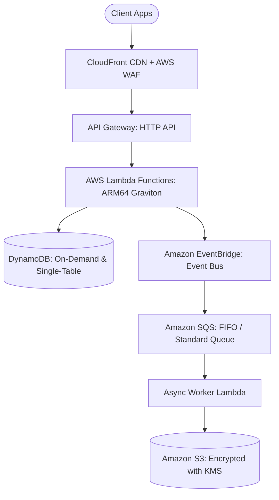

## Use this skill when

- Designing and implementing production architectures across AWS services.
- Architecting serverless systems with AWS Lambda, API Gateway, EventBridge, and SQS/SNS.
- Designing containerized applications with Amazon ECS (Fargate) or Amazon EKS.
- Modeling NoSQL databases with DynamoDB Single-Table Design patterns.
- Hardening IAM security with least-privilege policies, Permission Boundaries, and AWS KMS.
- Writing Infrastructure as Code using Terraform or AWS Cloud Development Kit (CDK).

## Do not use this skill when

- The project runs on Google Cloud, Azure, or OCI without AWS infrastructure.
- Local standalone scripting with no AWS cloud interactions.

## Instructions

- Strictly adhere to the AWS Well-Architected Framework 6 Pillars.
- Favor serverless (Lambda, Fargate, DynamoDB) to minimize undifferentiated operational burden.
- Never attach wildcards (`*`) to sensitive IAM actions or resources; specify ARNs and exact permissions.

---

## 1. AWS Serverless Reference Architecture



---

## 2. DynamoDB Single-Table Design Patterns

Consolidate multiple relational entities into a single DynamoDB table to minimize latency and cost:

| Entity | PK (Partition Key) | SK (Sort Key) | GSI1-PK | GSI1-SK | Data Attributes |
| :--- | :--- | :--- | :--- | :--- | :--- |
| **User** | `USER#123` | `METADATA` | `EMAIL#alice@corp.com` | `STATUS#ACTIVE` | `{ name: "Alice", tier: "PRO" }` |
| **Order** | `USER#123` | `ORDER#9981` | `STATUS#SHIPPED` | `DATE#2026-09-27` | `{ total: 199.50, items: 3 }` |
| **Payment** | `ORDER#9981` | `PAYMENT#1` | `PAYMENT_METHOD#CARD` | `DATE#2026-09-27` | `{ status: "SUCCESS" }` |

### Key Query Patterns
- Fetch User & all recent orders in a **single query**: `Query(PK = 'USER#123')`.
- Fetch all shipped orders sorted by date using **Global Secondary Index (GSI1)**.

---

## 3. Least-Privilege IAM Policy Blueprint

Avoid broad permissions. Bind policies to specific resource ARNs:

```json
{
  "Version": "2012-10-17",
  "Statement": [
    {
      "Sid": "AllowDynamoDBAccessToSpecificTable",
      "Effect": "Allow",
      "Action": [
        "dynamodb:GetItem",
        "dynamodb:PutItem",
        "dynamodb:UpdateItem",
        "dynamodb:Query"
      ],
      "Resource": [
        "arn:aws:dynamodb:us-east-1:123456789012:table/ProductionTable",
        "arn:aws:dynamodb:us-east-1:123456789012:table/ProductionTable/index/*"
      ]
    },
    {
      "Sid": "AllowKMSDecrypt",
      "Effect": "Allow",
      "Action": [
        "kms:Decrypt",
        "kms:GenerateDataKey"
      ],
      "Resource": "arn:aws:kms:us-east-1:123456789012:key/custom-encryption-key-uuid"
    }
  ]
}
```

---

## 4. Lambda Performance & Cost Optimization

- **Architecture**: Always select `arm64` (AWS Graviton) for up to 34% better price-performance than `x86_64`.
- **Memory Tuning**: Allocate memory between 1024MB and 1769MB to balance execution speed with CPU allocation (1 full vCPU at 1769MB).
- **Keep-Alive Connections**: Initialize AWS SDK clients outside the Lambda handler function to reuse HTTP keep-alive connections across warm invocations.
- **Power Tuning**: Use the open-source AWS Lambda Power Tuning tool to identify the cost-optimal memory configuration.

---

## 5. Anti-Patterns to Avoid

- **No RDS direct connections from high-concurrency Lambda**: Always place **AWS RDS Proxy** in front of PostgreSQL/MySQL to prevent connection pool exhaustion.
- **No Unencrypted S3 Buckets**: Enforce bucket policies that deny `s3:PutObject` unless server-side encryption with KMS is requested.
- **No Hardcoded IAM Credentials**: Use IAM Roles for Amazon EC2, ECS Tasks, or Lambda execution environments.
