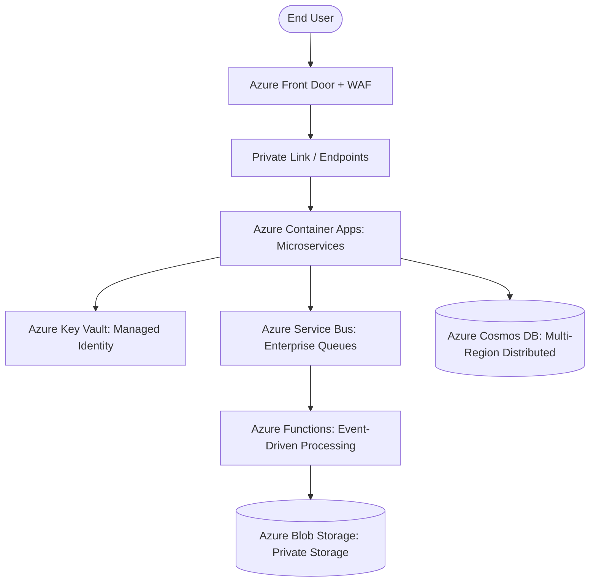

## Use this skill when

- Designing and building enterprise cloud solutions on Microsoft Azure.
- Deploying microservices to Azure Container Apps (ACA) or Azure Kubernetes Service (AKS).
- Securing cloud resources using Microsoft Entra ID and Managed Identities (passwordless connections).
- Designing multi-region, low-latency databases using Azure Cosmos DB.
- Implementing enterprise event-driven messaging with Azure Service Bus and Event Grid.
- Writing Infrastructure as Code using Azure Bicep or Terraform.

## Do not use this skill when

- The infrastructure is deployed on AWS, GCP, or OCI with no Azure footprint.
- Basic desktop or on-premise Windows administration.

## Instructions

- Enforce **Managed Identities** for service-to-service communication to completely eliminate connection strings and passwords.
- Use **Private Endpoints** to isolate PaaS services (Cosmos DB, Key Vault, Storage) inside the Azure Virtual Network.
- Default to **Azure Container Apps (ACA)** for containerized workloads that don't need full AKS cluster maintenance.

---

## 1. Azure Enterprise Architecture Blueprint



---

## 2. Passwordless Security with Managed Identities

Avoid storing database credentials or API keys in configuration files:

```csharp
// Program.cs (.NET 8 with Azure Identity)
using Azure.Identity;
using Azure.Security.KeyVault.Secrets;
using Microsoft.EntityFrameworkCore;

var builder = WebApplication.CreateBuilder(args);

// Connect to Azure Key Vault using DefaultAzureCredential (Managed Identity in Azure, CLI in local dev)
var keyVaultUri = new Uri(builder.Configuration["KeyVault:Uri"]!);
var secretClient = new SecretClient(keyVaultUri, new DefaultAzureCredential());

// Connect to Azure SQL Database passwordlessly via Entra ID Token
builder.Services.AddDbContext<AppDbContext>(options =>
{
    var connectionString = builder.Configuration.GetConnectionString("SqlDatabase")!;
    options.UseSqlServer(connectionString, sqlOptions =>
    {
        sqlOptions.EnableRetryOnFailure(maxRetryCount: 5);
    });
});
```

---

## 3. Infrastructure as Code with Azure Bicep

Deploy an Azure Container App with Managed Identity and Private Endpoints in clean Bicep syntax:

```bicep
// main.bicep
param location string = resourceGroup().location
param environmentName string = 'production-env'
param appName string = 'orders-service'
param containerImage string

resource containerAppEnv 'Microsoft.App/managedEnvironments@2023-05-01' = {
  name: environmentName
  location: location
  properties: {
    appLogsConfiguration: {
      destination: 'log-analytics'
    }
  }
}

resource containerApp 'Microsoft.App/containerApps@2023-05-01' = {
  name: appName
  location: location
  identity: {
    type: 'SystemAssigned' // Generates an Entra ID Managed Identity automatically
  }
  properties: {
    managedEnvironmentId: containerAppEnv.id
    configuration: {
      ingress: {
        external: true
        targetPort: 8080
      }
    }
    template: {
      containers: [
        {
          name: appName
          image: containerImage
          resources: {
            cpu: json('0.5')
            memory: '1.0Gi'
          }
        }
      ]
      scale: {
        minReplicas: 1
        maxReplicas: 20
        rules: [
          {
            name: 'http-scaling'
            http: {
              metadata: {
                concurrentRequests: '50'
              }
            }
          }
        ]
      }
    }
  }
}

output principalId string = containerApp.identity.principalId
```

---

## 4. Azure Service Bus Enterprise Messaging

Reliable message delivery with dead-lettering, sessions, and deduplication:

- **Sessions (FIFO Guarantee)**: Enable message sessions when strict chronological ordering per customer/entity is required.
- **Duplicate Detection**: Configure a duplicate detection window (e.g., 10 minutes) based on `MessageId`.
- **Auto-Dead-Lettering on Filter Evaluation Exceptions**: Automatically send poison messages to DLQ after `MaxDeliveryCount` attempts (default: 10).

---

## 5. Anti-Patterns to Avoid

- **No Public Endpoints for PaaS Data Stores**: Never allow public internet access to Azure SQL, Cosmos DB, or Storage Accounts; configure Private Endpoints with Network Security Groups (NSGs).
- **No Long-Lived Service Principal Client Secrets**: Rotate client secrets frequently or replace them with federated credentials.
- **No Static App Service Plan Over-Provisioning**: Use Consumption or Elastic plans to scale dynamically based on real traffic.
