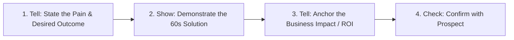

## Use this skill when

- Structuring enterprise sales pipelines, sales cadences, or go-to-market strategies for B2B cloud products.
- Qualifying enterprise software deals using the **MEDDPICC** or **BANT** frameworks.
- Crafting high-converting software demonstration scripts ("Tell-Show-Tell" formula).
- Drafting enterprise proposals, business cases (ROI calculators), and executive summaries.
- Overcoming IT/Security objections during vendor risk assessments (SOC 2, GDPR/LGPD, SSO, data encryption).
- Executing "Land and Expand" and customer retention/expansion strategies.

## Do not use this skill when

- Designing low-ticket B2C impulse purchase funnels without direct sales interaction.
- Basic CRM data entry tasks without strategic sales guidance.

## Instructions

- Always identify the **Economic Buyer** (the person with discretionary budget authority) and cultivate an internal **Champion**.
- Never conduct feature-tour demos: tailor every demonstration directly to the prospect's quantifiable business pains.
- Proactively address enterprise IT and security compliance requirements early in the sales cycle.

---

## 1. The MEDDPICC Deal Qualification Framework

Enterprise deals fail when reps cannot accurately diagnose deal health. Score every opportunity against MEDDPICC:

| Element | Definition | Critical Discovery Question |
| :--- | :--- | :--- |
| **M - Metrics** | Quantifiable business outcomes | *"What happens to revenue, downtime, or costs if this problem isn't solved in 6 months?"* |
| **E - Economic Buyer** | The person with ultimate P&L sign-off | *"Whose budget will fund this initiative, and how do they measure success?"* |
| **D - Decision Criteria** | Technical and business requirements | *"What specific technical benchmarks must we meet to be the selected vendor?"* |
| **D - Decision Process** | The approval and evaluation timeline | *"After technical approval, what steps and approvals are needed before contract signing?"* |
| **P - Paper Process** | Procurement, legal, and billing terms | *"What is your typical legal review turnaround time, and what standard MSAs do you use?"* |
| **I - Identify Pain** | Core operational or strategic friction | *"What is currently breaking in your workflow that led you to take this call today?"* |
| **C - Champion** | Internal ally with power and influence | *"Who inside your team has the most to gain from our solution succeeding?"* |
| **C - Competition** | Alternative vendors, DIY, or 'do nothing' | *"Are you considering building an in-house tool or evaluating other commercial platforms?"* |

---

## 2. High-Converting Product Demo Blueprint ("Tell-Show-Tell")

Demos must never be chronological tours of UI settings. Focus on value and business impact:



### The 4-Step Demo Formula
1. **Contextualize (Tell)**: *"You mentioned earlier that your developers spend 15 hours a week managing manual deployments..."*
2. **Execute (Show)**: Demonstrate the specific 1-click automated deployment pipeline in under 60 seconds without clicking unnecessary configuration menus.
3. **Anchor Impact (Tell)**: *"By automating this, your team recaptures ~60 engineering hours per month, saving an estimated $75,000 annually."*
4. **Confirm (Check)**: *"How does seeing this workflow align with what you were envisioning for your team?"*

---

## 3. Navigating Enterprise Security & IT Compliance

Enterprise software purchases stall in security reviews. Provide proactive security packages:

```
Enterprise Trust Package Checklist:
├── [ ] SOC 2 Type II or ISO 27001 Certification Summary
├── [ ] Cloud Architecture Security Diagram (VPC isolation, encryption in transit & rest via AES-256)
├── [ ] Data Protection & Privacy Addendum (DPA) compliant with GDPR/LGPD
├── [ ] Single Sign-On (SSO / SAML 2.0 / SCIM) Integration Guide
├── [ ] Role-Based Access Control (RBAC) & Audit Log Documentation
└── [ ] Third-Party Penetration Test Executive Summary
```

---

## 4. Closing & Negotiation Strategy

- **Give-to-Get Negotiation**: Never grant a discount without receiving something in return (e.g. *"We can offer a 10% discount on the annual contract if you agree to pay annually upfront and participate in a public case study"*).
- **Mutual Action Plan (MAP)**: Create a shared, date-driven checklist aligning technical validation, legal review, and go-live deadlines to prevent deals from slipping past quarter-end.
- **Land-and-Expand Strategy**: Close a smaller initial departmental pilot team ($10k-$25k ARR) with clear milestones, then expand into enterprise-wide licenses ($100k+ ARR) upon proven value.
