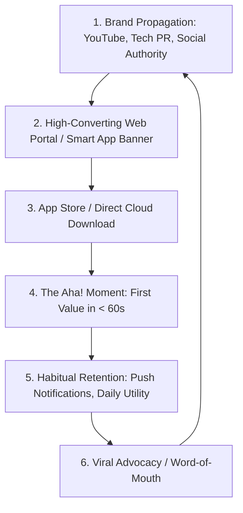

## Use this skill when

- Launching and propagating brand awareness for cloud-native platforms, SaaS, or mobile applications.
- Driving organic downloads, active user onboarding, and product adoption for new software systems.
- Designing YouTube tech authority channels, technical video tutorials, and demo showcases.
- Orchestrating multi-platform launch campaigns (Product Hunt, Show HN, Reddit, GitHub, tech media).
- Establishing category design, brand positioning, and the "Why Now?" narrative for innovative apps.
- Designing app activation funnels, smart download banners, and user retention loops (Day 1 / Day 7 / Day 30).

## Do not use this skill when

- Managing paid PPC ad bidding calculations (use `digital-marketing-paid-media`).
- Internal corporate HR communications.

## Instructions

- Turn technical capabilities into tangible consumer/business outcomes: lead with **"What you can achieve"**, not "What technologies we built with".
- Integrate multiple distribution flywheels: YouTube authority videos, social proof, and seamless app store landing funnels.
- Focus relentlessly on the **Activation Moment (Aha! Moment)** to ensure downloaded apps turn into habitually used daily tools.

---

## 1. Cloud-Native App Adoption & Distribution Flywheel

To get an application discovered, downloaded, and repeatedly used, connect brand awareness directly to product activation:

---

## 2. YouTube Tech Channel as a Brand Growth Engine

YouTube is the #1 discovery engine for software buyers and app users looking to solve real problems:

### The 3 Core Video Formats for Brand Propagation
1. **The "Pain-to-Solution" Showcase**:
   - Focus on an acute industry problem (e.g., *"Why monitoring distributed microservices usually costs $5,000/mo"*).
   - Demonstrate how your cloud-native app eliminates this problem in real-time.
   - Place a clear, trackable download link in the pinned comment and video description.
2. **The "Behind-the-Scenes" Architecture Deep Dive**:
   - Explain how you engineered the system (e.g., *"How we handle 1M events/sec using Go, Cloud Run, and OCI"*).
   - Builds immense technical authority and trust with decision makers, developers, and power users.
3. **The 3-Minute Quickstart Tutorial**:
   - Frictionless walkthrough showing a user downloading the app, logging in, and achieving the first outcome in under 3 minutes.

---

## 3. High-Impact Launch Playbook (Product Hunt, Hacker News, Reddit)

### Product Hunt Launch Blueprint
- **Timing**: Launch on a Tuesday or Wednesday at 12:01 AM PT to capture the full 24-hour voting cycle.
- **Visuals**: Animated GIF logo, high-contrast screenshot carousel with bold feature tags, and a crisp 60-second video demo.
- **Maker Comment**: Tell the personal founder story: what frustration led to creating the app, who it is for, and invite honest feedback.
- **First-Day Promotion**: Mobilize community, email list, and social followers to comment and test the product.

### "Show HN" (Hacker News) Rules of Engagement
- **Headline Formula**: `Show HN: [App Name] – An open/cloud-native tool to [do specific task]`.
- **Tone**: Strictly technical, humble, and devoid of marketing fluff or buzzwords.
- **Link**: Provide a direct live demo URL or GitHub repository where users can try it immediately without forcing an account creation upfront.

---

## 4. App Download Acceleration & Activation Funnel

Getting downloads is half the battle; ensuring active daily usage requires minimizing friction:

| Friction Point | Common Mistake | High-Growth Best Practice |
| :--- | :--- | :--- |
| **Web to App Bridge** | Sending users to homepages without clear app store links. | Use **Smart App Banners** on mobile web that deep-link directly to Google Play / App Store. |
| **QR Code Entry** | Generic black & white QR codes. | Customized branded QR codes placed on desktop websites, videos, and collateral with the call-to-action *"Scan to install on your phone"*. |
| **First-Time User Experience (FTUX)** | Requiring 10 profile fields before showing any value. | **Reverse Onboarding**: Allow users to explore sample data or perform their first core action *before* prompting for account creation. |
| **Day 1 Retention** | Radio silence after install. | Send a timely, value-driven push notification 3 hours post-install highlighting a killer shortcut or tip. |

---

## 5. Anti-Patterns to Avoid

- **No Premature Feature Bloat**: Highlight the 1 core superpower of your app that no competitor matches; don't overwhelm new prospects with 50 mediocre features.
- **No Vanity Metric Traps**: Measuring pure app installs without tracking Day 7 active users ($D7$) or core feature adoption.
- **No Generic Press Releases**: Pitch journalists and tech influencers with unique data, original benchmarks, or contrarian viewpoints rather than generic product announcements.
