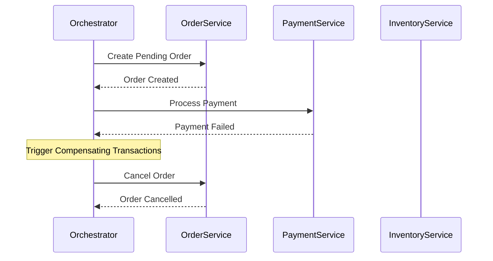

## Use this skill when

- Designing microservices architectures or distributed cloud applications.
- Establishing strategies for data consistency across boundary services (Saga patterns, Transactional Outbox).
- Enhancing application resiliency and fault tolerance (Circuit Breaker, Bulkhead, Retry with Jitter).
- Implementing event-driven data streaming pipelines, CQRS systems, or Event Sourcing infrastructure.
- Designing high-throughput caching policies (Cache-Aside, Write-Behind).

## Do not use this skill when

- Working on simple monolithic applications with low scale requirements.
- Standard cloud resource deployments (IaC Terraform templates) without application layer architecture design (use `cloud-architect` instead).

## Instructions

- Design distributed systems with eventual consistency in mind rather than forcing immediate ACID compliance.
- Implement circuit breakers and bulkheads on all external API requests to prevent cascading failures.
- Use the Transactional Outbox pattern to guarantee at-least-once message delivery in distributed events.

---

## 1. Resiliency & Fault-Tolerance Patterns

Protect applications from outages in downstream systems.

### Circuit Breaker Pattern
- **Closed State**: Traffic flows normally. Error rate is monitored.
- **Open State**: If error rate threshold is exceeded, the circuit opens. Downstream requests fail immediately without hitting the network, saving resources. A fallback response is returned.
- **Half-Open State**: After a cool-down period, a limited number of test requests are allowed. If they succeed, the circuit closes. If they fail, it reopens.

### Bulkhead Pattern
- Isolate system resources (threads, memory, connections) into distinct pools.
- **Example**: If the Payment service is slow, it should not consume all threads in the API Gateway and starve the Catalog search service. Assign dedicated thread pools to each service integration.

### Retry with Backoff & Jitter
- When retrying failed requests, use exponential backoff (`2s`, `4s`, `8s`) combined with **Jitter** (random delay). This prevents the "Thundering Herd" problem where all client retries hit the server at the exact same millisecond.

---

## 2. Distributed Transactions & Data Consistency

### Saga Pattern
Use a Saga to coordinate workflows across multiple microservices without locking databases.
- **Choreography**: Services publish and listen to events. Each service decides what action to take next based on the event received. Highly decentralized, low coupling, but harder to track.
- **Orchestration**: A centralized service (Orchestrator) manages the state transitions, coordinates actions, and triggers compensating transactions when a step fails. Easier to debug and monitor, but introduces a single point of dependency.

### Transactional Outbox Pattern
Avoid dual-write problems (writing to database and publishing to message queue in separate transactions).
1. Write to the database and write the integration event to an `Outbox` table in the *same* database transaction.
2. A separate background worker reads the `Outbox` table, publishes the message to the broker (RabbitMQ/Kafka), and marks the event as processed.
3. This guarantees **At-Least-Once Delivery** even if the message broker is temporarily offline.

---

## 3. High-Scale Data & Query Patterns

### CQRS (Command Query Responsibility Segregation)
Separate the read database schema from the write database schema.
- **Write side**: Optimized for transaction integrity (normalized schema, ACID, relational DB).
- **Read side**: Optimized for queries (denormalized schema, NoSQL DB, Elasticsearch).
- **Sync**: Read models are updated asynchronously via database triggers, Change Data Capture (CDC), or domain event consumers.

### Event Sourcing
- Instead of storing the current state of an object, store the sequence of state-changing events (the event log).
- Recreate the current state by replaying all historical events from the log.
- Provides a perfect audit log and allows temporal query execution (replaying state at any specific point in history).

---

## 4. Advanced Distributed Caching Strategies

- **Cache-Aside (Lazy Loading)**: Application queries the cache. If a cache miss occurs, it queries the DB, stores the result in the cache, and returns it. Best for read-heavy workloads.
- **Write-Through**: Application writes to the cache, which synchronously updates the database. Guarantees consistency, but adds write latency.
- **Write-Behind (Write-Back)**: Application writes to the cache, which asynchronously writes to the database in batches. High write performance, but risk of data loss if the cache service crashes.
