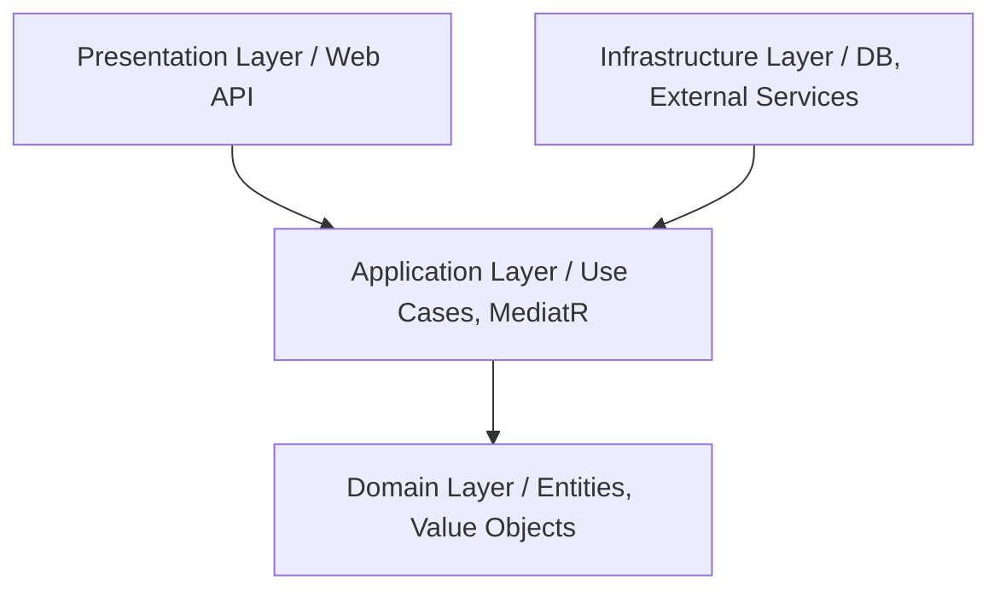

## Use this skill when

- Designing new .NET applications, microservices, or refactoring legacy C# systems into Clean Architecture.
- Implementing Domain-Driven Design (DDD) patterns such as Entities, Value Objects, Aggregates, and Domain Events in C#.
- Structuring CQRS (Command Query Responsibility Segregation) patterns with MediatR.
- Optimizing Entity Framework Core (EF Core) performance, tracking, and migrations.
- Writing unit, integration, or functional tests for .NET applications (xUnit, Moq, FluentAssertions, WebApplicationFactory).

## Do not use this skill when

- The project is written in languages other than C#/.NET.
- General backend patterns are needed without C#/.NET-specific optimizations.

## Instructions

- Ensure strict separation of concerns across clean architecture layers.
- Enforce the dependency rule: all dependencies point inward to the Domain layer.
- Optimize EF Core database queries by using AsNoTracking for read-only operations.

---

## 1. Clean Architecture Layers

Structure the solution into distinct project layers:



### Layer Responsibilities
1. **Domain**: The core of the application. Contains enterprise business rules, Entities, Value Objects, Domain Events, Enums, and Repository Interfaces. Has zero external dependencies (no references to EF Core, MediatR, or third-party libraries).
2. **Application**: Contains application-specific business rules. Implements use cases (MediatR Handlers), DTOs, FluentValidation validators, AutoMapper/Mapster profiles, and defines interfaces for infrastructure services (e.g. `IEmailService`, `IApplicationDbContext`).
3. **Infrastructure**: Implements the interfaces defined in Application/Domain layers. Contains database context (EF Core DbContext), migrations, repositories implementation, external API integrations, caching providers, and identity management.
4. **Presentation (Web API)**: The entry point of the application. Contains controllers/minimal APIs endpoints, OpenAPI/Swagger configurations, global exception handling middleware, and dependency injection registration.

---

## 2. Domain-Driven Design (DDD) in C#

Implement core DDD building blocks utilizing modern C# features:

### Entities & Aggregates
- Use C# `class` with private setters for properties. Express state transitions via public methods (behavior-oriented, avoiding anemic domain models).
- Use `Guid` or typed IDs to represent unique identities.

```csharp
public abstract class Entity
{
    public Guid Id { get; protected set; }
    private readonly List<IDomainEvent> _domainEvents = new();
    public IReadOnlyCollection<IDomainEvent> DomainEvents => _domainEvents.AsReadOnly();

    protected void RaiseDomainEvent(IDomainEvent domainEvent) => _domainEvents.Add(domainEvent);
    public void ClearDomainEvents() => _domainEvents.Clear();
}
```

### Value Objects
- Represent concepts with no identity (e.g., Money, Address).
- Use C# **Records** (with structural equality out of the box) or override `Equals` and `GetHashCode`.

```csharp
public record Address(string Street, string City, string ZipCode);
```

---

## 3. CQRS with MediatR & FluentValidation

Separate read and write operations into Commands and Queries:

- **Commands**: Modify application state. Do not return data, or only return minor metadata/IDs.
- **Queries**: Read data without modifying state. Return DTOs optimized for the UI.

### Request Pipeline Behavior
Implement cross-cutting concerns (Validation, Logging, Performance monitoring) using MediatR Pipeline Behaviors:

```csharp
public class ValidationBehavior<TRequest, TResponse> : IPipelineBehavior<TRequest, TResponse>
    where TRequest : IRequest<TResponse>
{
    private readonly IEnumerable<IValidator<TRequest>> _validators;
    public ValidationBehavior(IEnumerable<IValidator<TRequest>> validators) => _validators = validators;

    public async Task<TResponse> Handle(TRequest request, RequestHandlerDelegate<TResponse> next, CancellationToken cancellationToken)
    {
        var context = new ValidationContext<TRequest>(request);
        var validationFailures = _validators
            .Select(v => v.Validate(context))
            .SelectMany(result => result.Errors)
            .Where(f => f != null)
            .ToList();

        if (validationFailures.Any())
            throw new ValidationException(validationFailures);

        return await next();
    }
}
```

---

## 4. Entity Framework Core Performance Optimization

Implement best practices for database access with EF Core:

- **Read-Only Queries**: Always append `.AsNoTracking()` to queries that do not modify state. This disables EF Core tracking overhead and saves memory/CPU.
- **Query Splitting**: Use `.AsSplitQuery()` on queries that load large collections to prevent Cartesian explosion.
- **Compiled Queries**: Use compiled queries for hot path queries that execute frequently.
- **Interceptors**: Utilize EF Core Interceptors to automatically update audit fields (`CreatedAt`, `LastModifiedAt`) and dispatch Domain Events when saving changes.

```csharp
public override async Task<int> SaveChangesAsync(CancellationToken cancellationToken = default)
{
    // 1. Dispatch domain events
    // 2. Set Auditing properties
    return await base.SaveChangesAsync(cancellationToken);
}
```
---

## 5. Testing Strategy

- **Unit Tests**: Test domain entities and application handlers. Mock all infrastructure services using `Moq` or `NSubstitute`.
- **Integration Tests**: Test repository implementations and database queries using real container databases (e.g., Docker containers managed via `Testcontainers.MsSql` or `Testcontainers.PostgreSql`).
- **Functional/E2E Tests**: Test HTTP endpoints using `WebApplicationFactory<TProgram>` to run the application in-memory.
