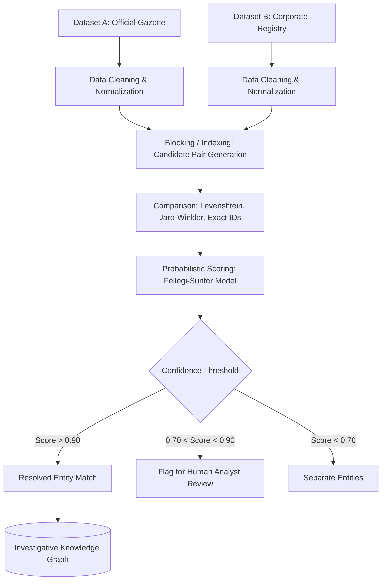
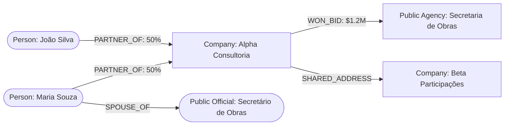

## Use this skill when

- Cross-referencing disparate and messy datasets during an investigation or audit.
- Performing **Entity Resolution** (Record Linkage) to determine whether two records refer to the same real-world entity.
- Matching corporate records, beneficial ownership data, procurement awards, and political donations.
- Normalizing and standardizing dirty data (names with typos, differing address formats, varying tax ID masks).
- Modeling complex relationships into **Knowledge Graphs** (Neo4j, NetworkX, Gephi).
- Screening entities against international sanctions lists (OFAC, UN, EU), PEP (Politically Exposed Persons) databases, and court gazettes.

## Do not use this skill when

- Standard database query optimization without entity resolution or investigative linking needs.
- Simple single-table sorting without cross-dataset matching.

## Instructions

- Always normalize fields (strip whitespace, lowercase, remove legal suffixes like `LTDA`/`Inc`, clean punctuation) before comparison.
- Use **Deterministic matching** when reliable unique keys (CPF/CNPJ/Tax IDs) exist; fall back to **Probabilistic Record Linkage** for names and addresses.
- Calculate match confidence scores and define clear thresholds for automatic match, review required, and non-match.

---

## 1. Entity Resolution Pipeline



---

## 2. Text Normalization & String Similarity Algorithms

Heterogeneous datasets contain typos, abbreviations, and differing conventions:

### Cleaning Pipeline
- **Names**: Remove honorifics (`Dr.`, `Eng.`), uppercase, strip accents (convert `José` to `JOSE`), remove non-alphanumeric characters.
- **Corporate Entities**: Strip legal structure suffixes (`LTDA`, `S.A.`, `ME`, `EIRELI`, `INC`, `LLC`). E.g., `ACME SOLUCOES TECNOLOGICAS LTDA` $\rightarrow$ `ACME SOLUCOES TECNOLOGICAS`.
- **Tax IDs**: Strip dots, slashes, and dashes (`12.345.678/0001-90` $\rightarrow$ `12345678000190`).
- **Addresses**: Standardize street descriptors (`Rua` $\rightarrow$ `R.`, `Avenida` $\rightarrow$ `AV.`), normalize postal codes (ZIP/CEP).

### Similarity Metrics
| Metric | Primary Use Case | Example |
| :--- | :--- | :--- |
| **Jaro-Winkler** | Short strings, person names; gives higher weight to prefix matches. | `JaroWinkler("Carlos Silva", "Carlos da Silva") = 0.93` |
| **Levenshtein Distance** | Typo detection; minimum edits (insertions, deletions, substitutions). | `Levenshtein("Petrobras", "Petrobraz") = 1 edit` |
| **Token Set Ratio** | Comparing strings with reordered or extra words. | `TokenSetRatio("Google Brasil Internet Ltda", "Google Brasil") = 100` |
| **Double Metaphone / Soundex** | Phonetic matching; sounds identical despite different spellings. | `Soundex("Smith") == Soundex("Smyth")` |

---

## 3. Investigative Knowledge Graph Modeling

Connect resolved entities to expose hidden networks, shell companies, and conflicts of interest:



### Cypher Query Example (Detecting Bid Rigging / Conflict of Interest)
```cypher
// Find public officials whose spouses or partners won government bids
MATCH (official:PublicOfficial)-[:SPOUSE_OF|PARTNER_OF]->(relative:Person)
MATCH (relative)-[:PARTNER_OF]->(company:Company)
MATCH (company)-[bid:WON_BID]->(agency:GovernmentAgency)
WHERE official.agencyId = agency.id
RETURN official.name, relative.name, company.name, bid.amount
```

---

## 4. Screening Against Public & Sanctions Registries

- **International Sanctions**: Screen against OFAC SDN, European Union Sanctions, and UN Security Council consolidated lists.
- **PEP Lists (Politically Exposed Persons)**: Flag transactions involving ministers, judges, parliamentarians, or their immediate family members.
- **Corporate Cross-Checks**:
  - Do two competing bidders in a government auction share the same registered fiscal address, accountant, or contact phone number?
  - Does a newly formed company ($< 30$ days old) with minimal capital win a multi-million-dollar tender?

---

## 5. Anti-Patterns to Avoid

- **No Cartesian Product Comparisons**: Never compare all $N$ records with all $M$ records ($O(N \times M)$); always apply **Blocking** (e.g., grouping by postal code, state, or soundex initial) to limit candidate pairs.
- **No Over-Reliance on Name Matching Alone**: Common names ("José da Silva") will produce disastrous false positives; always combine name similarity with a secondary attribute (birthdate, mother's name, city).
- **No Irreversible Data Loss**: Keep original unparsed raw data alongside normalized fields for auditing and legal verification.
