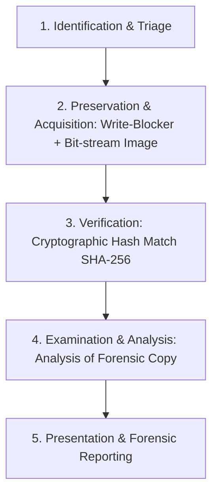

## Use this skill when

- Conducting digital forensic investigations or technical cyber investigations.
- Preserving, documenting, and validating the legal **Chain of Custody** for digital evidence (ISO/IEC 27037).
- Extracting and interpreting hidden metadata from files (EXIF, PDF metadata, Office XML revisions, UUIDs).
- Analyzing email headers (SPF, DKIM, DMARC, Received hop trails) to identify phishing, spoofing, or origin IPs.
- Investigating network traffic, server logs, or infrastructure footprints without altering target artifacts.
- Identifying anti-forensic techniques (timestomping, artifact wiping, steganography).

## Do not use this skill when

- Conducting unauthorized intrusions, network penetration attacks, or illegal hacking.
- Standard application bug debugging unrelated to forensic analysis.

## Instructions

- Strictly preserve the integrity of original evidence: always work on verified forensic copies, never on original files.
- Compute cryptographic hashes (SHA-256) immediately upon evidence acquisition and record timestamps.
- Document every investigative step to ensure findings are defensible in court or investigative audits.

---

## 1. Digital Evidence Lifecycle & Chain of Custody

Adhere to the 4 phases of digital forensics:



### Chain of Custody Record Template
```markdown
### Evidence Item: EVIDENCE-2026-001
- **Acquisition Timestamp**: 2026-09-27T23:45:00Z
- **Source**: Target Server Web Root `/var/log/nginx/`
- **Acquired By**: Lead Forensic Investigator
- **Original Filename**: access.log
- **Forensic Image Name**: evidence_001_access.raw
- **SHA-256 Hash**: `e3b0c44298fc1c149afbf4c8996fb92427ae41e4649b934ca495991b7852b855`
- **Storage Location**: Encrypted Offline Vault Drive #4
```

---

## 2. File Metadata & Deep Artifact Extraction

Hidden metadata often reveals identities, software versions, coordinates, and timelines:

### EXIF & Image Forensics
- **Geotags**: `GPSLatitude`, `GPSLongitude`, and altitude fields identify exact shooting coordinates.
- **Camera Fingerprint**: Camera make, model, serial number, lens parameters, and software version.
- **Timestamp Discrepancies**: Compare `DateTimeOriginal`, `CreateDate`, and `ModifyDate` with filesystem MACB timestamps.
- **Thumbnail Discrepancy**: Embedded EXIF thumbnails sometimes retain the original unedited image even after the main photo has been cropped or redacted.

### Document Forensics (PDF & Office OpenXML)
- Inspect `Author`, `LastModifiedBy`, `RevisionNumber`, and `Template` metadata fields.
- Check XML relationships (`word/_rels/document.xml.rels`) for internal network paths (`\\server\share\user\...`) and GUIDs.

---

## 3. Email Header Tracing & Verification

Inspect email headers from bottom to top to trace the true transmission path:

```
Received: from mail.attacker.com (mail.attacker.com [198.51.100.24])  <-- Originating Hop
    by mx.google.com with ESMTPS ...
Authentication-Results: mx.google.com;
    dkim=fail header.i=@legitimate-bank.com;
    spf=fail (google.com: domain of alert@attacker.com does not designate 198.51.100.24 as permitted sender);
    dmarc=fail (p=REJECT)
Message-ID: <random-uuid@attacker.com>
X-Mailer: PHPMailer 6.5.0
```

### Analysis Checklist
- **SPF (Sender Policy Framework)**: Does the sending server's IP match the domain's TXT SPF record?
- **DKIM (DomainKeys Identified Mail)**: Is the cryptographic signature valid for the sending domain?
- **DMARC**: Does the `From` header align with SPF/DKIM domains? If not, investigate domain impersonation.
- **Hop Timeline**: Calculate latency between successive `Received:` hops to identify anomalous proxy relays.

---

## 4. Anti-Forensics & Tampering Detection

- **Timestomping**: An attacker modifies the file's creation/modification timestamps. In NTFS filesystems, compare the `$STANDARD_INFORMATION` attribute against `$FILE_NAME` timestamps; an attacker frequently alters the former while leaving the latter intact.
- **Log Gaps**: Sudden discontinuities in sequence IDs or timestamp gaps in system journals (`journalctl`, syslog) indicate log purging or service stoppages.
- **Zero-Filling / File Slack**: Check file slack space for fragmented remnants of deleted payloads.

---

## 5. Anti-Patterns to Avoid

- **No Direct Analysis on Evidence Media**: Always create a bit-level forensic image (`dd` or `ewf-tools`) and work strictly on a clone.
- **No Reliance on File Extensions**: Attackers rename `.exe` or `.sh` files to `.png` or `.pdf`. Always verify file headers (magic bytes, e.g. `4D 5A` for PE executables, `7F 45 4C 46` for ELF).
- **No Unhashed Transfers**: Never move evidence across network connections or storage media without computing before-and-after cryptographic hashes.
