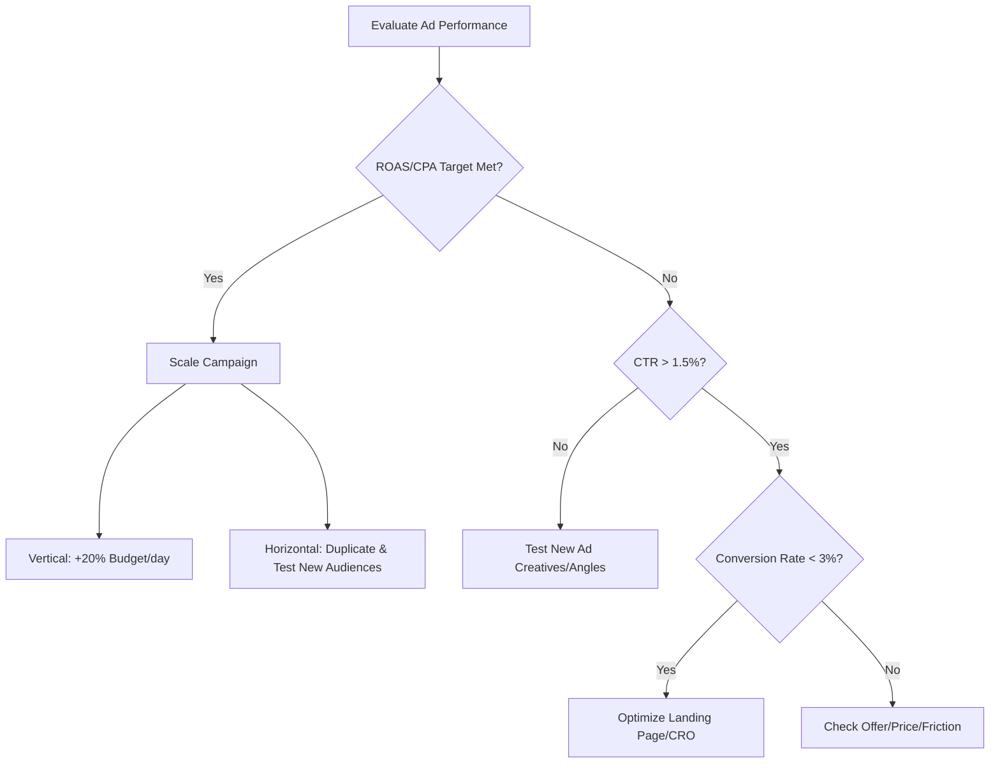

## Use this skill when

- Designing media buying plans, ad campaigns, budget allocation strategies, or channel-mix models.
- Writing ad creatives, headings, hooks, and body copy for Facebook/Meta, Google Search/Display, or TikTok Ads.
- Structuring analytics tracking, attribution models, and UTM parameters for marketing links.
- Auditing or optimizing landing pages, conversion funnels, and checkout flows for Conversion Rate Optimization (CRO).
- Calculating marketing performance metrics (CAC, LTV, ROAS, CPA, CTR, CPM, CPC).

## Do not use this skill when

- Designing generic organic search optimization (SEO) without paid traffic focus (use `seo-content-writer` or `seo-structure-architect`).
- Dealing with general public relations (PR) or organic social media growth without performance advertising focus (use `viral-growth-hacking` instead).

## Instructions

- Target high performance and conversions by testing multiple creative angles.
- Maintain accurate tracking and data hygiene with strict UTM naming conventions.
- Focus landing pages on a single, clear action (CTA) above the fold.

---

## 1. Ad Copywriting & Creative Angles

To maximize Click-Through Rate (CTR) and conversion rates, use structured copywriting frameworks:

### Copywriting Frameworks
1. **PAS (Problem-Agitate-Solve)**:
   - *Problem*: Call out a painful problem your persona experiences.
   - *Agitate*: Intensify the pain by highlighting the consequences of ignoring it.
   - *Solve*: Introduce your product/service as the ultimate, painless solution.
2. **AIDA (Attention-Interest-Desire-Action)**:
   - *Attention*: Open with a striking hook (question, shocking statistic, bold claim).
   - *Interest*: Share a story, result, or unique feature to build curiosity.
   - *Desire*: Appeal to emotional benefits, social proof (reviews, testimonials), or risk reversal (guarantees).
   - *Action*: Give a clear, direct Call to Action (e.g., "Click here to download for free").

### Platform Creatives
- **Meta (Facebook/Instagram)**: Focus on emotional hooks and high-quality visuals. The first 3 lines of copy must hook the user before the "... See More" link.
- **Google Search**: Focus on high-intent query matching. Pin high-performing keyword combinations to Headlines 1 & 2. Include extensions/assets (sitelinks, callouts).
- **TikTok/Shorts**: Focus on UGC (User Generated Content) style video formats. First 3 seconds must have a hook (text overlay, visual shift). Avoid corporate-looking ads.

---

## 2. UTM Tracking & Attribution Standards

Maintain data cleanliness to enable accurate attribution. Use lowercase, hyphen-separated values.

| Parameter | Purpose | Example |
| :--- | :--- | :--- |
| `utm_source` | Platform/Advertiser where traffic originates | `meta`, `google`, `tiktok`, `newsletter` |
| `utm_medium` | Channel type or marketing medium | `cpc`, `retargeting`, `email`, `sponsor` |
| `utm_campaign` | Specific campaign name, objective, or product | `black-friday-2026`, `launch-course-v1` |
| `utm_content` | Specific ad copy, creative, or button version | `video-testimonial`, `image-discount-15` |
| `utm_term` | Paid keywords or target audience details | `cloud-architect-courses`, `remarketing-visitors` |

*Best Practice Link Example:*
`https://yoursite.com/landing-page?utm_source=meta&utm_medium=cpc&utm_campaign=black-friday-2026&utm_content=image-discount-15`

---

## 3. Landing Page & Funnel CRO checklist

Ensure the target landing page has high conversion potential before launching paid ads:

### Above the Fold (Hero Section)
- [ ] **Clear Headline**: Focuses on the main value proposition, not features. Responds to the ad hook in < 3 seconds.
- [ ] **Subheadline**: Expands on how the value proposition is delivered.
- [ ] **High-Contrast Call to Action (CTA)**: Large button that contrasts visually with the background.
- [ ] **Hero Image/Video**: Visual demonstration of the product in action.
- [ ] **No Navigation Menu**: Remove headers and footers to keep the user focused on the landing page action.

### Below the Fold (Body & Social Proof)
- [ ] **Social Proof**: Customer testimonials with faces, names, and concrete results. Logos of recognized clients.
- [ ] **Benefit Blocks**: Simple 3-column layout highlighting key benefits (speed, cost-savings, ease of use).
- [ ] **FAQ Section**: Anticipate and address common objections (price, compatibility, guarantees).
- [ ] **Trust Badges & Security**: Encryption logos, money-back guarantees near the checkout/form.

---

## 4. Campaign Optimization & Scaling Rules

When evaluating performance, follow a systematic optimization checklist:

- **Vertical Scaling**: Increase budget by 10-20% every 2-3 days to avoid resetting the platform's learning phase.
- **Horizontal Scaling**: Launch high-performing creatives to lookalike audiences (LALs), broad targeting, or competitor interest groups.
- **Creative Fatigue**: Refresh creatives every 2-4 weeks (faster on TikTok than Meta) to prevent audience fatigue.
