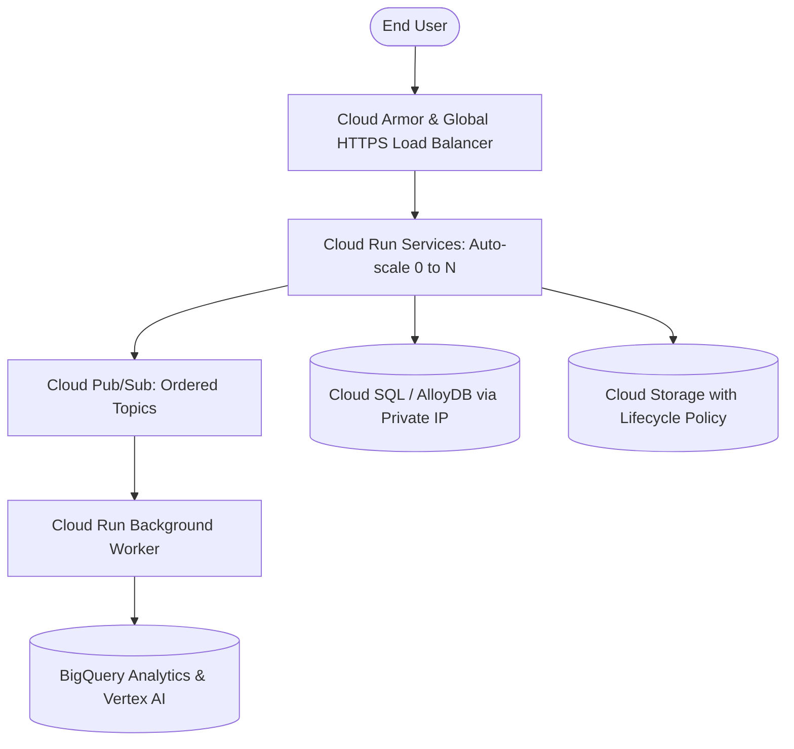

## Use this skill when

- Designing and deploying scalable, secure infrastructure on Google Cloud Platform (GCP).
- Architecting serverless container workflows with Cloud Run and Eventarc.
- Setting up Google Kubernetes Engine (GKE Autopilot) and multi-cluster networks.
- Implementing Workload Identity Federation to eliminate static JSON service account keys.
- Designing data analytics and AI pipelines with BigQuery, Vertex AI, and Cloud Pub/Sub.
- Writing Infrastructure as Code (IaC) with Terraform for GCP resources.

## Do not use this skill when

- The project is deployed exclusively on AWS, Azure, or OCI without GCP components.
- Generic local development without cloud infrastructure planning.

## Instructions

- Enforce zero static service account keys: always use Workload Identity Federation for GitHub Actions and Kubernetes.
- Default to Cloud Run for containerized web workloads before opting for full GKE clusters.
- Apply VPC Service Controls and Cloud Armor to protect sensitive endpoints from data exfiltration and DDoS attacks.

---

## 1. Core GCP Architectural Reference



---

## 2. Keyless CI/CD with Workload Identity Federation

Never download static `.json` service account keys. Authenticate GitHub Actions via OIDC:

```yaml
# .github/workflows/deploy-gcp.yml
name: Deploy to Cloud Run
on:
  push:
    branches: [main]

jobs:
  deploy:
    runs-on: ubuntu-latest
    permissions:
      contents: read
      id-token: write # Required for Workload Identity

    steps:
      - uses: actions/checkout@v4

      - id: auth
        uses: google-github-actions/auth@v2
        with:
          workload_identity_provider: 'projects/123456789/locations/global/workloadIdentityPools/github-pool/providers/github-provider'
          service_account: 'ci-deployer@my-project-id.iam.gserviceaccount.com'

      - name: Deploy to Cloud Run
        uses: google-github-actions/deploy-cloudrun@v2
        with:
          service: 'core-api'
          region: 'us-central1'
          image: 'us-docker.pkg.dev/my-project-id/containers/core-api:${{ github.sha }}'
```

---

## 3. Cloud Run Enterprise Configuration (Terraform)

Deploy production-grade Cloud Run with Private VPC access and autoscaling limits:

```hcl
resource "google_cloud_run_v2_service" "api_service" {
  name     = "api-service"
  location = "us-central1"
  ingress  = "INGRESS_TRAFFIC_INTERNAL_LOAD_BALANCER"

  template {
    scaling {
      min_instance_count = 1  # Eliminate cold starts for mission-critical APIs
      max_instance_count = 100
    }

    containers {
      image = "us-central1-docker.pkg.dev/${var.project_id}/apps/api:latest"
      
      resources {
        limits = {
          cpu    = "2"
          memory = "2Gi"
        }
        cpu_idle = true # Scale CPU down when no requests are active
        startup_cpu_boost = true # Accelerate initial container boot
      }

      env {
        name  = "NODE_ENV"
        value = "production"
      }
    }

    vpc_access {
      network_interfaces {
        network    = google_compute_network.custom_vpc.id
        subnetwork = google_compute_subnetwork.custom_subnet.id
      }
      egress = "PRIVATE_RANGES_ONLY"
    }
  }
}
```

---

## 4. Pub/Sub Resiliency & Dead-Letter Queues

Handle message processing failures gracefully without losing messages:

```bash
# 1. Create Dead Letter Topic
gcloud pubsub topics create orders-dlq

# 2. Create Dead Letter Subscription
gcloud pubsub subscriptions create orders-dlq-sub --topic=orders-dlq

# 3. Create Main Subscription with DLQ configured
gcloud pubsub subscriptions create orders-sub \
    --topic=orders-main \
    --ack-deadline=60 \
    --min-retry-delay=10s \
    --max-retry-delay=600s \
    --dead-letter-topic=orders-dlq \
    --max-delivery-attempts=5
```

---

## 5. Security & FinOps Governance

- **BigQuery Cost Controls**: Set maximum bytes billed limits on queries to avoid runaway analytical query costs.
- **Artifact Registry Cleanup**: Implement lifecycle policies to automatically delete old container image tags after 30 days.
- **Secret Manager Access**: Grant `roles/secretmanager.secretAccessor` only to the runtime service account, avoiding wide project-level roles.
