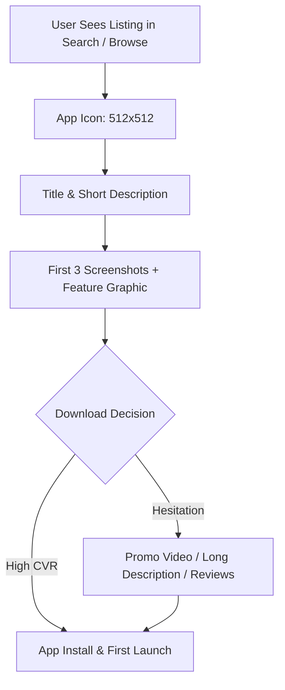

## Use this skill when

- Preparing, publishing, and managing Android applications on the **Google Play Console**.
- Implementing **App Store Optimization (ASO)** to maximize organic search rankings and browse traffic.
- Designing high-converting store listing creatives (App Icons, Feature Graphics, Screenshots with text overlays, Promo Videos).
- Running Store Listing Experiments (A/B tests) to improve download conversion rates.
- Ensuring compliance with Google Play Developer Policies (Data Safety Form, Target API levels, Sensitive Permissions declarations).
- Navigating the **14-day closed testing requirement** with 20 testers for new personal developer accounts.
- Monitoring and optimizing **Android Vitals** (User-perceived crash rates and ANR thresholds).

## Do not use this skill when

- Developing Apple App Store specific submissions (iOS App Store Connect).
- General web SEO unrelated to mobile app distribution.

## Instructions

- Keep keywords concentrated in the **Title** (30 chars) and **Short Description** (80 chars), which have the highest algorithmic weight.
- Never use misleading keywords or mention competitors' brand names in the metadata.
- Android Vitals must stay below the bad behavior thresholds (Crash rate $< 1.09\%$, ANR $< 0.47\%$) to prevent Google Play from demoting your search rank.

---

## 1. App Store Optimization (ASO) Metadata Architecture

Google Play's algorithm ranks apps based on title relevance, short description keywords, install velocity, and Android Vitals health:

| Field | Max Length | Algorithmic Weight | Best Practice Strategy |
| :--- | :--- | :--- | :--- |
| **App Title** | 30 characters | Highest | `Brand Name: Primary Keyword` (e.g. `Odin Intel: AI Cloud Monitor`) |
| **Short Description** | 80 characters | High | Strong emotional hook + secondary keywords. Highlight core benefit. |
| **Long Description** | 4000 characters | Medium | Keyword density 2-3%. Bullet points of key features, social proof, and FAQs. |
| **Package Name** | Fixed ID | Low/Medium | Incorporate a relevant keyword in the package name (e.g. `com.company.cloudmonitor`). |

---

## 2. Store Listing Creative Psychology & Conversion Optimization

Visual assets drive the **Store Listing Conversion Rate (CVR)**:

### Visual Asset Standards
- **App Icon (512x512 PNG)**: High contrast, clean silhouette, no clutter, and recognizable on dark/light themes. Avoid small text inside icons.
- **Feature Graphic (1024x500 JPG/PNG)**: Crucial for being featured on Google Play. Keep focal points centered (avoid placing important text in the outer 15% edges).
- **Screenshots (Minimum 4, Recommended 6-8)**:
  - **Screenshot 1**: Shows the core killer feature in action with a large, readable heading text at the top (e.g., *"Deploy Cloud Native Apps in Seconds"*).
  - **Screenshot 2**: Shows secondary benefits (speed, cost-savings, automation).
  - **Screenshot 3**: Social proof or enterprise security badge.
- **Promo Video**: Link a landscape YouTube video (30-60 seconds) without ads. Autoplays silently on the listing.

---

## 3. Store Listing Experiments (A/B Testing Framework)

Never guess which creative performs better; test variations systematically:

1. **Test One Element at a Time**: Run an experiment testing only the **Icon** or only the **First 3 Screenshots**; never change multiple variables simultaneously.
2. **Sample Size & Duration**: Run the test for a minimum of 7 days to cover weekend vs. weekday behavioral variations.
3. **Statistical Confidence**: Only apply the winning variation once the confidence interval reaches at least **90%**.

---

## 4. Google Play Policy Compliance & Closed Testing

### The 14-Day Closed Testing Rule (Personal Accounts)
New personal developer accounts must complete a closed test before applying for production access:
- **Requirement**: Minimum **20 testers** opted-in continuously for at least **14 days**.
- **Engagement**: Testers must actually download, open, and test the app; Google analyzes telemetry to verify real usage.
- **Production Application**: Be prepared to answer questions about how testers were recruited, what feedback was collected, and what bug fixes were implemented.

### Data Safety Form & Sensitive Permissions
- Disclose all collected data (User ID, Email, Crash Logs, Diagnostics).
- Specify whether data is encrypted in transit and whether users can request account and data deletion via a public URL.
- If using Foreground Services (`FOREGROUND_SERVICE`), ensure you have a legitimate, user-initiated reason and provide a video demonstration link for Google Play Reviewers.

---

## 5. Android Vitals & Quality Thresholds

Google Play demotes apps with poor technical quality in search results:

- **User-perceived Crash Rate**: Threshold is **$1.09\%$** (all devices) and **$8\%$** (per device model).
- **User-perceived ANR (Application Not Responding) Rate**: Threshold is **$0.47\%$** (all devices).
- **Optimization**: Use Android App Bundles (`.aab`) to reduce download size. Implement crash reporting (Crashlytics, Sentry) and fix issues before releasing updates.
