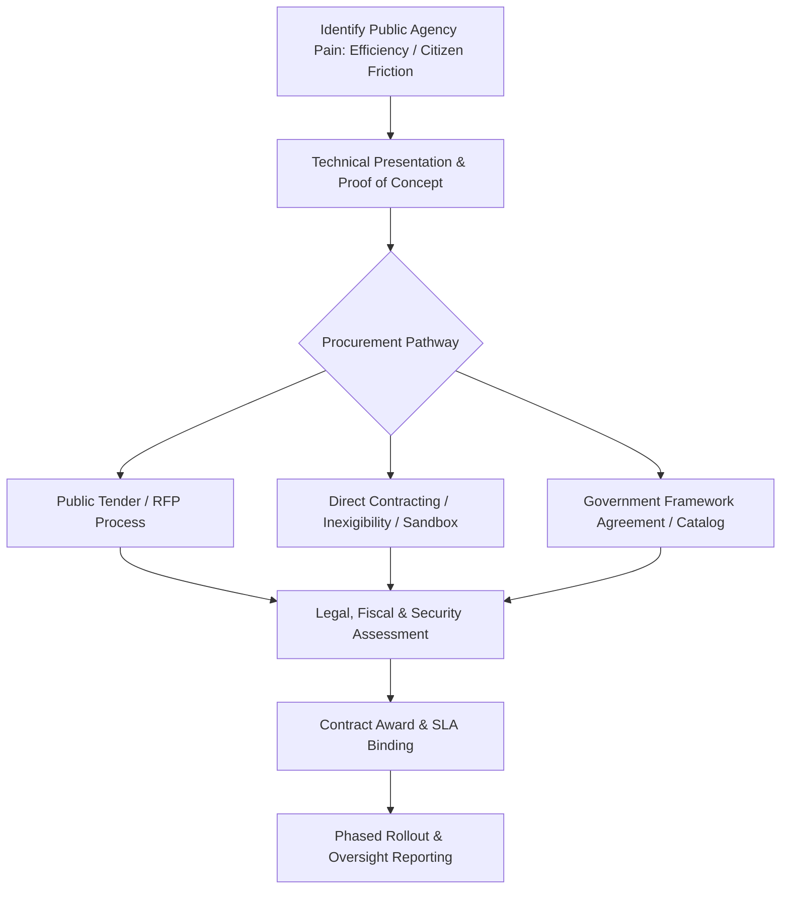

## Use this skill when

- Developing technology products, applications, or cloud systems for government bodies (federal, state, municipal).
- Navigating public sector procurement, Requests for Proposal (RFPs), public tenders, and direct contracting frameworks.
- Structuring compliance with government data protection regulations (public sector LGPD/GDPR, FOIA/LAI transparency laws).
- Designing sovereign cloud architectures and strict data residency compliance for public records.
- Creating value propositions tailored to political leadership, civil servants, and citizen end-users.
- Implementing interoperability standards (e-Gov APIs, citizen digital identity integration).

## Do not use this skill when

- Designing purely private-sector commercial campaigns with no government or regulatory intersection.
- Providing formal legal representation in court (use legal counsel).

## Instructions

- Align system value with **public transparency, operational efficiency, and citizen satisfaction**.
- Strictly adhere to sovereign data residency and strict auditability requirements (comprehensive immutable logs).
- Account for public procurement cycles, regulatory sandboxes, and auditing oversight by official oversight bodies.

---

## 1. GovTech Engagement & Procurement Framework

Selling technology to the public sector follows rigorous legal pathways:



### Procurement Pathways
1. **Public Tender / Open RFP**: Standard competitive bidding based on technical specifications and price. Requires strict conformity to qualification documents (certidões negativas, financial capacity, technical aptitude certificates).
2. **Direct Contracting / Inexigibility**: Applicable when the software has unique intellectual property, no direct equivalent market substitute, or when participating in designated **Regulatory Sandboxes**.
3. **Framework Agreements (GSA / Ata de Registro de Preços)**: Pre-negotiated government catalogs where agencies can purchase pre-approved software without running an independent bidding process from scratch.

---

## 2. Public Sector Data Security & Sovereign Cloud Architecture

Public entities handle sensitive citizen records and must comply with high standards:

```
Public Cloud Governance Matrix:
├── Data Residency: All databases and backups must reside physically within sovereign borders.
├── Immutable Audit Logs: Every read/write action by operators must be logged to tamper-proof WORM storage.
├── Interoperability: APIs must follow RESTful/OpenAPI open standards to prevent vendor lock-in.
├── Accessibility: Portals and apps must adhere to accessibility mandates (WCAG 2.1 AA / e-MAG).
└── Citizen Identity: Integrate with single-sign-on public identity systems (e.g. Gov.br, Login.gov).
```

---

## 3. Positioning Software for Public Decision Makers

Civil servants and elected officials evaluate software through distinct lenses:

| Stakeholder | Primary Motivation | Messaging & Proof Points |
| :--- | :--- | :--- |
| **Elected Leadership (Mayors, Ministers, Governors)** | Political legacy, visible citizen impact, positive media coverage. | *"Launches a modern digital service for 500,000 citizens with measurable satisfaction ratings in under 90 days."* |
| **Agency Directors & Department Heads** | Meeting statutory mandates, reducing backlog, operational speed. | *"Eliminates manual paper processing backlogs by 80% and reduces service turnaround from 14 days to 4 hours."* |
| **Audit & Legal Oversight Bodies** | Legal compliance, preventing irregularities, transparency. | *"Fully compliant with public transparency laws, with automatic audit log exports for audit courts."* |
| **IT & Security Officers** | Uptime, cybersecurity, ease of maintenance, open standards. | *"Cloud native architecture with 99.99% SLA, private VPC network isolation, and zero proprietary lock-in."* |

---

## 4. Anti-Patterns to Avoid

- **No Vendor Lock-In Traps**: Public sector entities legally favor open APIs and easy data export capabilities; proprietary data capture triggers procurement rejections.
- **No Ignoring Administrative Oversight**: Ensure every cost item and SLA metric is defensible before public audit tribunals.
- **No Generic Commercial Pitches**: Avoid private-sector buzzwords; speak in terms of public interest, fiscal efficiency, and citizen rights.
