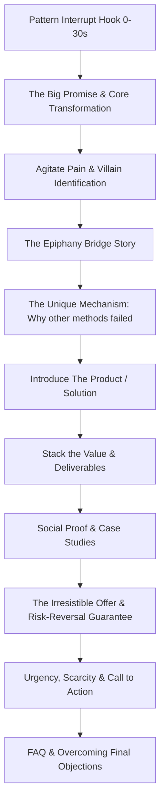

## Use this skill when

- Writing direct-response sales pages, landing page copy, or Video Sales Letters (VSLs).
- Designing email marketing automation sequences (welcome/onboarding, nurture, launch, cart abandonment, win-back).
- Applying Eugene Schwartz's 5 stages of market awareness to position offers and headlines.
- Structuring multi-step digital sales funnels (Lead Magnets, Tripwires, Core Offers, One-Click Upsells/Downsells).
- Formulating irresistible offers, pricing tiers, guarantees, and risk reversals.

## Do not use this skill when

- Writing corporate PR announcements, regulatory disclosures, or technical manuals.
- General SEO keyword stuffing without direct response intent (use `seo-content-writer`).

## Instructions

- Always identify the audience's **Awareness Stage** before writing a single headline.
- Sell the **transformation and emotional outcome**, not just technical features.
- Eliminate risk completely using aggressive guarantees, social proof, and specific demonstrations.

---

## 1. Eugene Schwartz's 5 Levels of Awareness

Match copy tone, headline style, and length directly to the prospect's mindset:

| Awareness Level | Prospect Mindset | Headline & Copy Strategy |
| :--- | :--- | :--- |
| **Most Aware** | Knows product, price, and reputation; just needs the deal. | Direct offer: discounts, bonuses, urgency, deadlines. |
| **Product Aware** | Knows your product exists, but hasn't bought; comparing rivals. | Differentiators, unique mechanism, superior guarantees, testimonials. |
| **Solution Aware** | Knows results they want, but doesn't know your specific product. | Prove why your category/mechanism beats alternative solutions. |
| **Problem Aware** | Feels the pain acutely, but doesn't know a solution exists. | Agitate the pain, validate feelings, introduce new possibility. |
| **Unaware** | Has no realization of problem; completely cold audience. | Broad human curiosity hook, intriguing story, secret revelation. |

---

## 2. High-Converting VSL & Sales Letter Architecture

Structure long-form sales pages and video sales letters with this sequence:

### Key Elements of the Offer Stack
- **Core Product**: The primary deliverable that solves the main problem.
- **Speed Bonus**: Eliminates the delay to first value.
- **Friction-Killer Bonus**: Solves the next obstacle created by using the main product.
- **Risk Reversal**: "Double your money back" or "Try 30 days risk-free: keep the bonuses even if you cancel".

---

## 3. High-Converting Email Sequences

### 1. The Soap Opera Sequence (First 5 Days of Welcome)
- **Email 1 (Set the Stage)**: Deliver the lead magnet instantly; open a curiosity loop about what is coming tomorrow.
- **Email 2 (High Drama & Backstory)**: Drop into the middle of the hardest moment before discovering the solution.
- **Email 3 (The Epiphany)**: Reveal the core breakthrough / unique mechanism.
- **Email 4 (Hidden Benefits & Transformations)**: Highlight non-obvious lifestyle/business gains achieved by the method.
- **Email 5 (Urgency & Hard Call-to-Action)**: Deadline, expiring bonus, or opening of registration with direct buy link.

### 2. Cart Abandonment Sequence (3-Touch Formula)
- **Touch 1 (1 hour post-abandonment)**: "Did everything go okay with your checkout?" (Helpful, non-pushy, technical check).
- **Touch 2 (12 hours post-abandonment)**: Customer testimonial + objection buster addressing price/time investment.
- **Touch 3 (24 hours post-abandonment)**: Expiring hold on reserved inventory/discount code.

---

## 4. Persuasion Checklists & Anti-Patterns

### Pre-Publish Checklist
- [ ] Is there a single, clear desired action (one CTA)?
- [ ] Are claims substantiated with specific numbers, screenshots, or third-party proof?
- [ ] Did you address the top 3 objections: *Can I afford it? Will it work for me? Do I have time for this?*
- [ ] Are paragraphs kept under 3 lines for visual breathing room on mobile?

### Anti-Patterns to Avoid
- **Feature Dumping**: Listing technical specs without explaining "which means that you can [benefit]".
- **Vague Claims**: Saying "increase your revenue dramatically" instead of "add $3,450 to your MRR in 30 days".
- **Weak or Confusing CTA**: Having 3 different offers competing on the same page.
