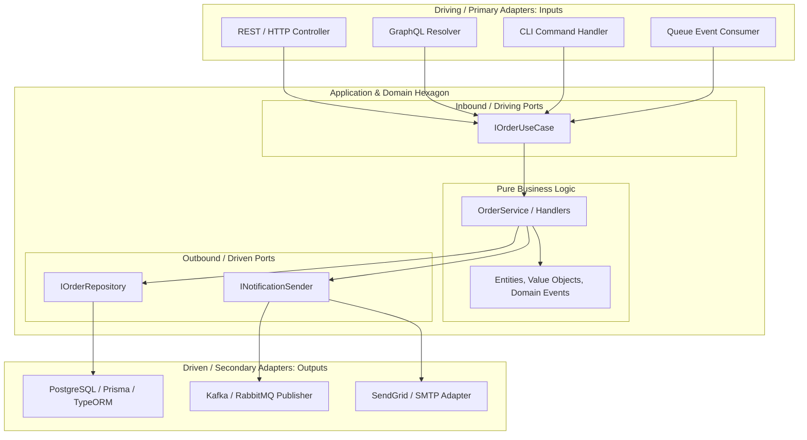

## Use this skill when

- Designing long-term maintainable backend systems, microservices, or domain cores.
- Decoupling core business logic from frameworks (Express, NestJS, FastAPI, Spring, ASP.NET).
- Implementing the Ports and Adapters architectural pattern.
- Structuring Domain-Driven Design (DDD) boundaries, Aggregates, Entities, and Value Objects.
- Defining Driving (Primary) vs Driven (Secondary) ports and their concrete adapters.
- Writing lightning-fast unit tests that require zero database mocks or containers.

## Do not use this skill when

- Building simple CRUD applications or quick prototypes where the indirection overhead outweighs the benefits.
- Scripting single-use CLI utilities.

## Instructions

- Ensure the **Domain Core** has **zero external dependencies** (no ORMs, no framework imports, no HTTP libraries).
- Define **Ports as interfaces** inside the Domain/Application layer; implement **Adapters** in the Infrastructure layer.
- Dependencies must strictly point inwards: Infrastructure $\rightarrow$ Application $\rightarrow$ Domain.

---

## 1. Ports and Adapters Architecture Diagram



---

## 2. Directory Layout & Dependency Rules

```
src/
├── domain/                      # 1. INNERMOST LAYER (Pure logic, Zero dependencies)
│   ├── models/
│   │   ├── order.entity.ts      # Entity with business rules
│   │   ├── money.vo.ts          # Value Object
│   │   └── order-status.enum.ts
│   ├── events/
│   │   └── order-created.event.ts
│   └── exceptions/
│       └── invalid-order.error.ts
├── application/                 # 2. USE CASES & PORTS
│   ├── ports/
│   │   ├── in/                  # Driving Ports (interfaces for use cases)
│   │   │   └── create-order.usecase.ts
│   │   └── out/                 # Driven Ports (interfaces for infra)
│   │       ├── order-repository.port.ts
│   │       └── event-publisher.port.ts
│   └── services/                # Use case implementation
│       └── create-order.service.ts
└── infrastructure/              # 3. OUTERMOST LAYER (Adapters & Frameworks)
    ├── adapters/
    │   ├── driving/             # Primary Adapters
    │   │   └── rest/
    │   │       ├── order.controller.ts
    │   │       └── dto/
    │   └── driven/              # Secondary Adapters
    │       ├── persistence/
    │       │   ├── order.prisma-repository.ts
    │       │   └── order.orm-entity.ts
    │       └── messaging/
    │           └── rabbitmq.publisher.ts
    └── config/                  # DI Container wiring
```

---

## 3. Concrete Code Blueprint: Ports & Pure Domain

### Pure Domain Entity (No TypeORM/Prisma Annotations)
```typescript
// domain/models/order.entity.ts
export class Order {
  private constructor(
    public readonly id: string,
    public readonly customerId: string,
    private _totalAmount: number,
    private _status: 'PENDING' | 'CONFIRMED' | 'CANCELLED'
  ) {}

  public static create(id: string, customerId: string, totalAmount: number): Order {
    if (totalAmount <= 0) {
      throw new Error('Order total must be positive');
    }
    return new Order(id, customerId, totalAmount, 'PENDING');
  }

  public confirm(): void {
    if (this._status !== 'PENDING') {
      throw new Error('Only pending orders can be confirmed');
    }
    this._status = 'CONFIRMED';
  }

  public get status() { return this._status; }
  public get totalAmount() { return this._totalAmount; }
}
```

### Driven Port Interface
```typescript
// application/ports/out/order-repository.port.ts
import { Order } from '../../domain/models/order.entity';

export interface IOrderRepository {
  findById(id: string): Promise<Order | null>;
  save(order: Order): Promise<void>;
}
```

### Application Service Implementing Inbound Port
```typescript
// application/services/create-order.service.ts
import { Order } from '../../domain/models/order.entity';
import { IOrderRepository } from '../ports/out/order-repository.port';
import { ICreateOrderUseCase, CreateOrderCommand } from '../ports/in/create-order.usecase';

export class CreateOrderService implements ICreateOrderUseCase {
  constructor(private readonly orderRepo: IOrderRepository) {}

  async execute(command: CreateOrderCommand): Promise<string> {
    const order = Order.create(command.orderId, command.customerId, command.amount);
    await this.orderRepo.save(order);
    return order.id;
  }
}
```

---

## 4. Testing Advantages of Hexagonal Architecture

- **Domain Tests**: Test 100% of business constraints in milliseconds without running Docker, SQLite in-memory, or web servers.
- **Application Tests**: Mock ports with simple in-memory arrays:
  ```typescript
  class InMemoryOrderRepository implements IOrderRepository {
    public orders: Order[] = [];
    async save(order: Order) { this.orders.push(order); }
    async findById(id: string) { return this.orders.find(o => o.id === id) || null; }
  }
  ```
- **Infrastructure Tests**: Test only the adapters (e.g. verifying that Prisma queries execute properly against PostgreSQL).

---

## 5. Anti-Patterns to Avoid

- **No Domain Model with ORM Decorators**: Putting `@Entity()` or `@Column()` in domain models leaks the database schema into the domain core.
- **No Direct Calls between Driving and Driven Adapters**: Controllers must never import or call Repositories directly; they must always invoke an Application Service.
- **No Leaking HTTP/Transport Concepts into Application Services**: Never pass `req`, `res`, or HTTP status codes into Application Use Cases.
