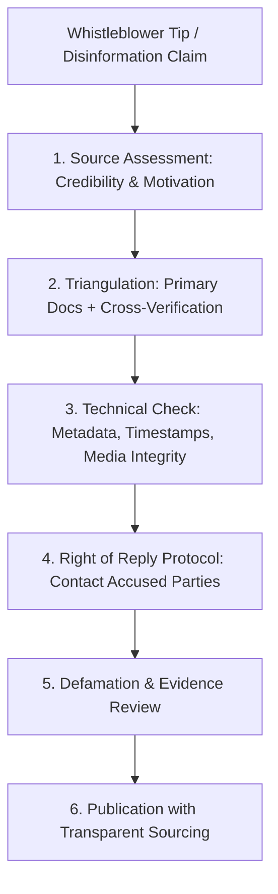

## Use this skill when

- Conducting in-depth journalistic investigations, data journalism, or accountability reporting.
- Executing rigorous fact-checking following the **International Fact-Checking Network (IFCN)** principles.
- Verifying viral claims, news reports, and controversial public statements.
- Detecting disinformation, manipulated imagery, shallowfakes, and AI-generated deepfakes.
- Drafting investigative stories, narratives, and investigative dossiers with defensible sourcing.
- Implementing whistleblower safety, source protection, and managing **Right of Reply** protocols.

## Do not use this skill when

- Writing unverified gossip, uncorroborated rumors, or promotional PR press releases.
- Publishing defamatory allegations without offering the accused party a fair opportunity to respond.

## Instructions

- Enforce the **Three-Source Rule**: never report a critical factual assertion without corroboration from at least three independent, reliable sources or verified primary official documents.
- Always offer the subjects of an investigation a formal, documented **Right of Reply** with reasonable time to respond before publication.
- Treat anonymous sources as leads, never as standalone proof; corroborate their claims with documentary evidence.

---

## 1. Investigative Journalism Verification Matrix



---

## 2. Fact-Checking Standards (IFCN Protocol)

Adhere to the 5 core commitments of the International Fact-Checking Network:

1. **Commitment to Nonpartisanship and Fairness**: Apply the same rigorous evidentiary standards to all political figures, corporations, and organizations regardless of ideology.
2. **Commitment to Standards and Transparency of Sources**: Provide readers with direct links and instructions to verify every primary source cited.
3. **Commitment to Transparency of Methodology**: Explain the exact tools, search queries, and public records consulted to reach the conclusion.
4. **Commitment to Open and Honest Corrections**: When an error occurs, correct it prominently and transparently, explaining what changed and why.

### Sourcing Ground Rules
- **On the Record**: Name and title can be published; statements can be directly quoted.
- **On Background**: Information can be used and quoted, but attributed to an agreed description (e.g. *"a senior Treasury official"*).
- **Deep Background**: Information can be used to guide reporting and find proof, but cannot be quoted or attributed to any official.
- **Off the Record**: Information is shared solely for the reporter's context and cannot be published or passed on.

---

## 3. Disinformation & Deepfake Detection Playbook

Manipulated media falls into two categories: **Shallowfakes** (cheap editing) and **Deepfakes** (AI synthesis).

### 1. Shallowfakes (80% of viral fakes)
- **Recycled Footage**: Reverse-search keyframes (via InVID / Google Images / Yandex) to verify if a video depicts an event from years earlier in a different country.
- **Selective Cropping**: Check if critical context or a contradictory sign was cropped out of the frame.
- **Speed Manipulation**: Slowing speech by 10-15% to make a speaker appear intoxicated or impaired.

### 2. Deepfakes & AI-Generated Media
- **Facial Irregularities**: Look for inconsistent lighting between face and background, unnatural reflection in eyes (corneal reflections should match ambient light), and teeth rendering anomalies.
- **Edge Artifacts**: Blurring or flickering around hair, ears, collar lines, and eyeglasses during motion.
- **Audio Spectral Analysis**: AI speech synthesis often exhibits robotic cadence, lack of breathing sounds, or unnatural frequency cutoffs above 16 kHz.

---

## 4. The Right of Reply Protocol

Before publishing an investigative piece alleging wrongdoing, follow this structured procedure:

```markdown
### Formal Request for Comment Template
To: [Spokesperson / Legal Counsel / Target]
Subject: Formal Request for Comment - Investigation into [Topic]
Deadline: [Specific Date & Time, minimum 24-48 hours prior to publication]

Dear [Name],

We are finalizing an investigative report concerning [summary of topic]. 
In the interest of accuracy, fairness, and journalistic rigor, we request your response to the following specific findings:

1. [Specific Finding 1, with dates, contract numbers, or documents referenced]
2. [Specific Finding 2, addressing alleged discrepancies]
3. [Specific Finding 3, concerning financial or operational decisions]

Please provide your responses in writing by [Date, Time, Timezone]. 
Your responses will be incorporated into the final publication. If you choose not to respond, our report will state that you were offered the opportunity to comment and declined.
```

---

## 5. Anti-Patterns to Avoid

- **No Confirmation Bias**: Don't discard evidence that contradicts your initial investigative hypothesis; follow where the facts lead.
- **No Unredacted Whistleblower Documents**: Never publish raw whistleblower PDFs without stripping hidden printer tracking dots, author metadata, internal server URLs, and distinctive watermarks that could identify the leaker.
- **No Sensationalized Unsubstantiated Headlines**: Headlines must strictly reflect the verified facts; avoid hyperbole that outpaces the evidence.
