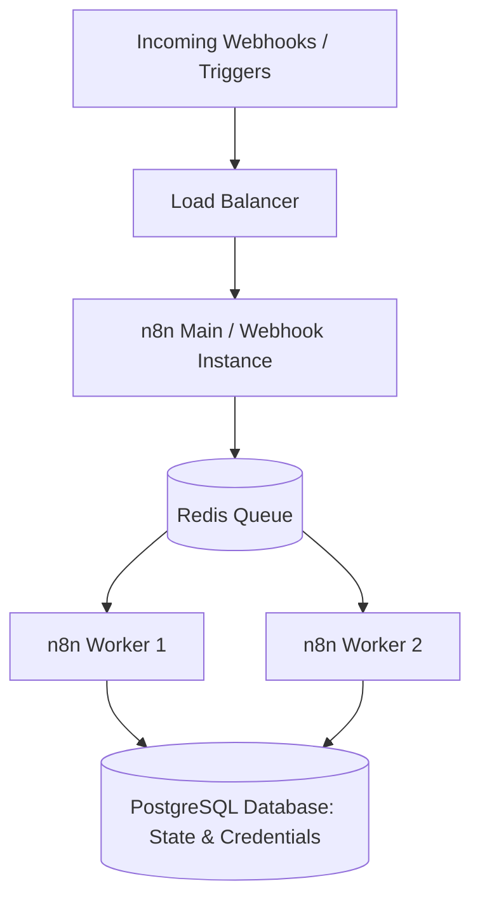
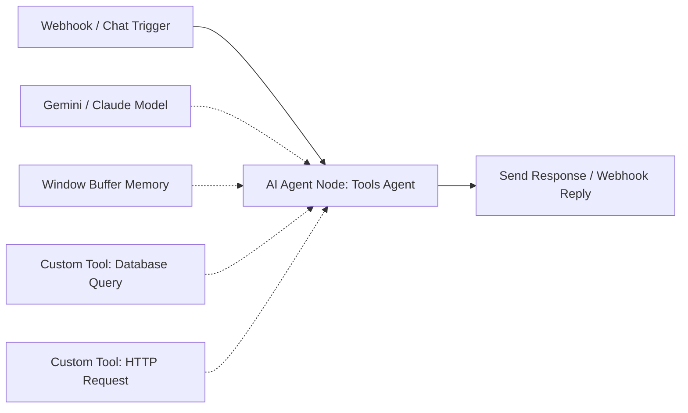

## Use this skill when

- Designing, building, or debugging automation workflows with n8n (cloud or self-hosted).
- Creating webhook-driven event pipelines, scheduled batch processing, or API integration chains.
- Integrating AI Agent nodes, LLMs (Gemini, Claude, GPT), vector stores, and custom tools in n8n.
- Structuring sub-workflows with the `Execute Workflow` node for modularity and reuse.
- Configuring error-trigger workflows, retry policies, and dead-letter alerting (Telegram, Slack, Email).
- Optimizing n8n execution performance, queue mode (Redis + Postgres), and memory consumption.

## Do not use this skill when

- Writing low-level standalone cron jobs or scripts with zero n8n integration.
- Standard Kubernetes administration unrelated to n8n scaling.

## Instructions

- Modularize complex workflows: split monolithic pipelines into reusable sub-workflows.
- Always attach an **Error Trigger Workflow** to mission-critical pipelines to capture failed executions.
- Use the **Code Node** for high-volume data transformations instead of daisy-chaining dozens of single-purpose nodes.

---

## 1. n8n Enterprise Architecture & Queue Mode

For production environments handling high throughput, deploy n8n in **Queue Mode**:



### Key Environment Variables
```bash
# Production Queue Mode Config
EXECUTIONS_MODE=queue
QUEUE_BULL_REDIS_HOST=redis
QUEUE_BULL_REDIS_PORT=6379
DB_TYPE=postgresdb
DB_POSTGRESDB_HOST=postgres
DB_POSTGRESDB_DATABASE=n8n
EXECUTIONS_DATA_PRUNE=true
EXECUTIONS_DATA_MAX_AGE=168 # Prune logs older than 7 days
```

---

## 2. Advanced AI Agent Integration in n8n

n8n includes native LangChain-powered nodes:



### Custom Tool Configuration inside Code Node
When building custom tools for the n8n AI Agent node, return clean, structured JSON:

```javascript
// Inside Code Tool Node
const inputData = $input.first().json;

try {
  const result = await makeApiCall(inputData.query);
  return {
    output: JSON.stringify({
      status: "success",
      data: result
    })
  };
} catch (error) {
  return {
    output: JSON.stringify({
      status: "error",
      message: error.message
    })
  };
}
```

---

## 3. Modular Sub-Workflow Pattern

Avoid 100-node monster canvases. Decouple logic using the `Execute Workflow` node:

- **Parent Workflow**: Validates authentication, unpacks payload, calls Sub-Workflow, and returns HTTP response.
- **Sub-Workflow**: Receives `{ customerId, payload }`, executes the business process, and returns `{ success: true, processedItems: 5 }`.
- **Settings**: Set "Wait for Sub-Workflow Completion" to `true` when parent needs the return payload; set to `false` for async "fire-and-forget" jobs.

---

## 4. Resilient Error Handling & Dead-Letter Alerts

Configure an **Error Trigger Workflow** and set it in the workflow settings:

1. **Error Trigger Node**: Receives metadata `{ executionId, workflowName, errorMessage, timestamp }`.
2. **Alert Node**: Dispatches an instant notification with a direct link to the failed execution:
   ```
   🚨 *Workflow Failure Alert*
   • Workflow: {{ $json.workflow.name }}
   • Error: {{ $json.execution.error.message }}
   • Link: https://n8n.yourdomain.com/workflow/{{ $json.workflow.id }}/executions/{{ $json.execution.id }}
   ```
3. **Dead-Letter Storage**: Write failed event payloads to a `failed_events` database table for replay.

---

## 5. Anti-Patterns to Avoid

- **No Unlimited Execution History**: Keep `EXECUTIONS_DATA_PRUNE=true` to prevent PostgreSQL disk fill-ups from huge JSON binary blobs.
- **No Hardcoded API Keys in HTTP Request Nodes**: Always store secrets in n8n Credentials.
- **No Unbatched High-Volume Iterations**: Use the `Loop Over Items` node with a defined batch size (e.g., 50 items) to prevent memory crashes when processing thousands of records.
