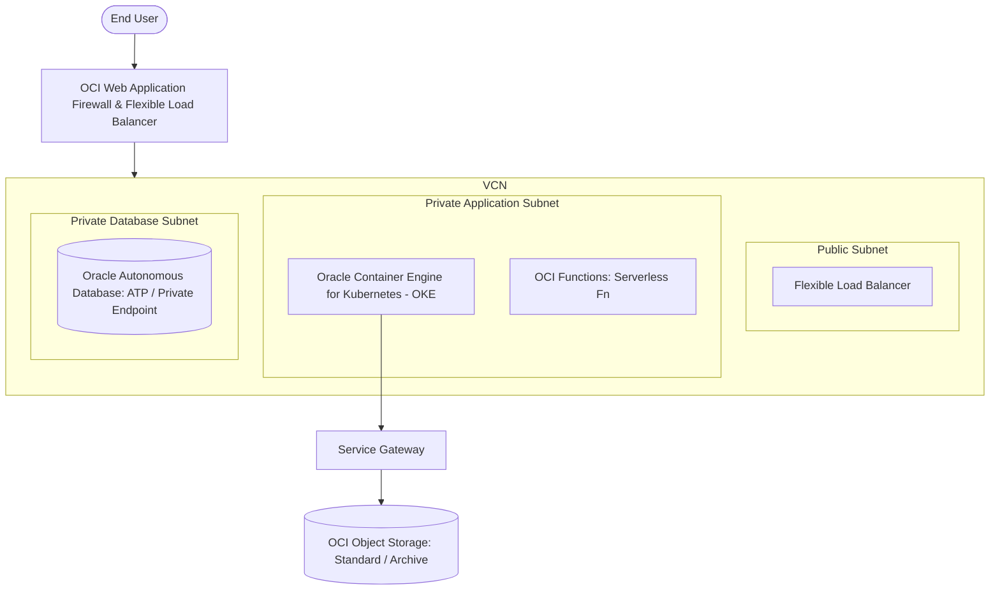

## Use this skill when

- Designing and building enterprise cloud solutions on Oracle Cloud Infrastructure (OCI).
- Structuring OCI governance hierarchies with Compartments, Tagging, and Budgets.
- Deploying and managing Kubernetes clusters using Oracle Container Engine for Kubernetes (OKE).
- Implementing Oracle Autonomous Database (ATP/ADW) or MySQL Database Service with HeatWave.
- Writing OCI IAM Policies with granular verbs (`inspect`, `read`, `use`, `manage`).
- Architecting Virtual Cloud Networks (VCN), Security Lists, NSGs, and Service Gateways.
- Provisioning OCI resources with Terraform using the `oracle/oci` provider.

## Do not use this skill when

- The project runs exclusively on AWS, GCP, or Azure with no OCI resources.
- General on-premises Oracle DBA tasks unrelated to cloud architecture.

## Instructions

- Organize all resources into well-defined **Compartment hierarchies**; never place workloads in the root tenancy compartment.
- Prefer **Network Security Groups (NSGs)** over Security Lists for fine-grained, workload-level traffic filtering.
- Take advantage of **Service Gateways** to access Oracle Services (Autonomous DB, Object Storage) privately without routing over the public internet.

---

## 1. OCI Enterprise Architecture Blueprint



---

## 2. OCI IAM Policy Syntax & Best Practices

OCI policies follow a declarative English syntax. Verbs dictate permission levels:
- `inspect`: List resources without seeing user-defined metadata.
- `read`: View resources and their metadata.
- `use`: Work with existing resources (cannot create or delete).
- `manage`: Full administrative access (create, read, update, delete).

```sql
-- Allow developers to manage OKE clusters inside the Dev compartment
Allow group Developers to manage cluster-family in compartment Production:App-Dev

-- Allow OKE worker nodes (via Dynamic Group) to access Object Storage privately
Allow dynamic-group OKEWorkerNodes to read objects in compartment Production:App-Dev where target.bucket.name='app-assets'

-- Allow database administrators to manage Autonomous Databases only
Allow group DBA-Admins to manage autonomous-database-family in compartment Production:Databases
```

---

## 3. Terraform for OCI (Autonomous Database & OKE)

Provision an Autonomous Transaction Processing (ATP) database on OCI:

```hcl
# main.tf
terraform {
  required_providers {
    oci = {
      source  = "oracle/oci"
      version = ">= 5.0.0"
    }
  }
}

resource "oci_database_autonomous_database" "app_db" {
  compartment_id           = var.compartment_id
  db_name                  = "appdbprod"
  display_name             = "Application Production Database"
  db_workload              = "OLTP"
  is_auto_scaling_enabled  = true
  is_free_tier             = false
  cpu_core_count           = 1
  data_storage_size_in_tbs = 1
  admin_password           = var.db_admin_password

  # Secure inside Private VCN
  subnet_id                = oci_core_subnet.db_private_subnet.id
  nsg_ids                  = [oci_core_network_security_group.db_nsg.id]

  license_model            = "BRING_YOUR_OWN_LICENSE" # Or "LICENSE_INCLUDED"
}
```

---

## 4. OKE (Oracle Container Engine for Kubernetes) Best Practices

- **Node Types**: Combine Managed Nodes with **Virtual Nodes** (serverless Kubernetes execution without managing VM nodes).
- **ARM Ampere A1 Compute**: Leverage OCI's Ampere A1 (ARM64) instances for outstanding cost-efficiency (4 OCPUs and 24GB RAM available in the Always Free tier).
- **OCI VCN-Native CNI**: Use OCI VCN-Native Pod Networking for direct IP allocation from VCN subnets, minimizing packet encapsulation overhead.

---

## 5. Anti-Patterns to Avoid

- **No Flat Compartment Structure**: Don't put networking, compute, and databases in one unstructured compartment. Use separate compartments for environment tiers (`Dev`, `Staging`, `Prod`).
- **No Internet Gateways for Databases**: Autonomous Databases and MySQL systems must always be bound to private subnets with private endpoints.
- **No Root Tenancy Credentials in CI/CD**: Always use scoped IAM user credentials or instance principals/workload identity tokens for automated deployments.
