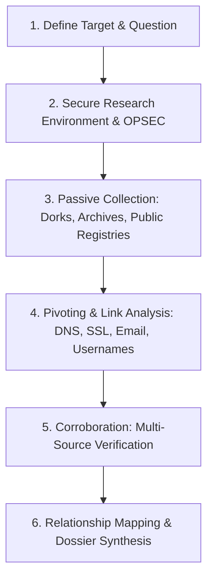
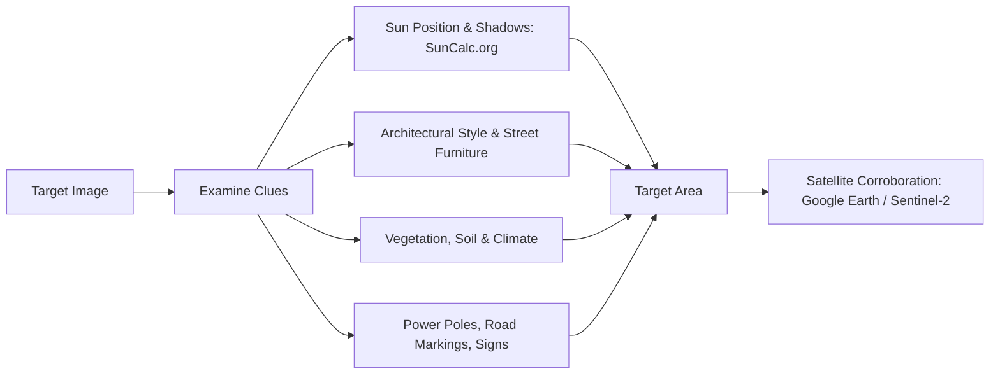

## Use this skill when

- Conducting Open Source Intelligence (OSINT) research on individuals, organizations, domains, or infrastructure.
- Constructing complex Google / Search Dorks to locate publicly exposed documents, databases, and login portals.
- Pivoting on network artifacts (WHOIS, DNS records, SSL Certificate Transparency logs, tracking IDs).
- Performing social media intelligence (SOCMINT) and cross-platform username correlation.
- Geolocating images or videos (GEOINT) using landmarks, shadows, weather, and satellite imagery.
- Mapping intelligence findings into structured relationship graphs.

## Do not use this skill when

- Executing active vulnerability exploitation, network attacks, or invasive port scans.
- Violating local surveillance laws or conducting harassment.

## Instructions

- Strictly maintain **Operational Security (OPSEC)**: use clean research environments, burner accounts, and route traffic to avoid tipping off targets.
- Document the primary source URL, timestamp, and an archived copy (Wayback Machine / archive.today) for every piece of intelligence.
- Pivot across independent identifiers (e.g. from a shared Google AdSense ID to connected subsidiary domains).

---

## 1. The OSINT Investigation Lifecycle



---

## 2. Advanced Search Engine Dorking Catalog

Uncover indexable records hidden behind site architectures:

| Objective | Search Dork Query |
| :--- | :--- |
| **Exposed Documents** | `site:target.gov filetype:pdf OR filetype:xlsx OR filetype:docx "confidential" OR "internal"` |
| **Config & Environment Files** | `site:target.com ext:env OR ext:yml OR ext:json "DB_PASSWORD" OR "api_key"` |
| **Directory Indexing** | `site:target.com "Index of /" intext:"backup" OR intext:"admin"` |
| **Unlinked Subdomains** | `site:*.target.com -www.target.com` |
| **Login / Management Portals** | `site:target.com inurl:admin OR inurl:login OR inurl:dashboard` |
| **Cached / Removed Content** | `cache:target.com/page-url` or search `archive.today/target.com` |

---

## 3. Infrastructure Pivoting (Domains, DNS & SSL)

Pivot from a single clue to map an adversary or organization's digital footprint:

### 1. Certificate Transparency (CT) Logs
Query `crt.sh` to uncover all subdomains ever issued an SSL certificate, including staging and internal testing services:
```bash
# Querying Certificate Transparency via curl
curl -s "https://crt.sh/?q=%25.target.com&output=json" | jq -r '.[].name_value' | sort -u
```

### 2. Analytics & AdSense Fingerprinting
Sites built by the same entity often share tracking IDs:
- Look for Google Analytics IDs (`UA-XXXXX` or `G-XXXXX`), Facebook Pixel IDs, or Yandex Metrica IDs in page sources.
- Query reverse tracking engines to discover all domains owned by the same account.

### 3. Historical DNS & WHOIS
- Use security intelligence engines (SecurityTrails, RiskIQ, ViewDNS) to uncover historical IP addresses and original domain registrants before WHOIS privacy protection was enabled.
- Identify co-hosted websites sharing the same dedicated IP address.

---

## 4. Visual Geolocation & Imagery Analysis (GEOINT/IMINT)

Geolocate photographs and video footage using systematic environmental clues:



- **Shadow & Time Estimation**: Analyze the direction and angle of shadows using SunCalc to identify the time of day and orientation (cardinal directions).
- **Reverse Image Search Engines**: Use Yandex and Bing Visual Search for superior facial and architectural recognition compared to standard engines.
- **Street Furniture & Infrastructure**: License plate formats, driving side of the road, electrical outlet standards, and utility pole designs narrow countries within seconds.

---

## 5. Anti-Patterns to Avoid

- **No Active Contact from Personal Accounts**: Never visit social profiles of investigation subjects using your real personal accounts; social platforms alert targets ("Who viewed your profile").
- **No Reliance on Single Sources**: Never declare an identity match based solely on matching usernames across platforms without corroborating evidence (email, location, writing style).
- **No Unarchived Ephemeral Evidence**: Social media posts and forum threads get deleted; immediately capture offline MHTML copies or archive via web archiving services.
