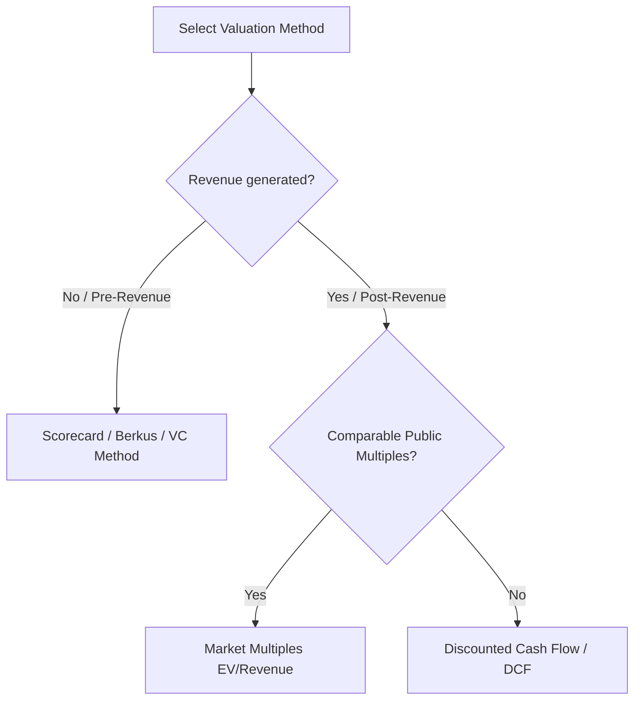

## Use this skill when

- Designing or reviewing financial models, projection spreadsheets, or revenue forecast templates.
- Calculating or auditing SaaS unit economics metrics (CAC, LTV, LTV:CAC, MRR, ARR, Churn, NRR, GRR).
- Modeling startup runway, gross/net burn rate, and operating expenses (OpEx).
- Designing cap tables, evaluating funding dilution, SAFE notes, convertible notes, or equity structures.
- Valuation analysis using Discounted Cash Flow (DCF), market multiples, Venture Capital (VC) method, or Berkus/Scorecard methods.

## Do not use this skill when

- The task focuses on standard corporate accounting, payroll, or tax filing.
- Optimizing consumer banking or retail investment strategies (use `quant-analyst` or `risk-manager` instead).

## Instructions

- Target a healthy LTV:CAC ratio greater than 3.0x for SaaS/subscription businesses.
- Clearly differentiate between Pre-Money and Post-Money valuation during funding simulations.
- Map cohort retention curves to identify product-market fit viability.

---

## 1. SaaS Unit Economics & Cohort Analysis

Analyze and project key metrics to validate business model viability:

### Key Metrics Formulas
- **CAC (Customer Acquisition Cost)**:
  $$\text{CAC} = \frac{\text{Sales \& Marketing Costs}}{\text{Number of New Customers Acquired}}$$
- **LTV (Lifetime Value - simplified)**:
  $$\text{LTV} = \frac{\text{ARPU} \times \text{Gross Margin \%}}{\text{Revenue Churn Rate}}$$
  *Where ARPU is Average Revenue Per User.*
- **LTV:CAC Ratio**: Target **$\ge 3.0\text{x}$**. A ratio $< 3.0\text{x}$ suggests unsustainable customer acquisition costs. A ratio $> 5.0\text{x}$ may indicate under-investing in growth.
- **Net Revenue Retention (NRR)**: Measures expansion revenue from existing customers.
  $$\text{NRR} = \frac{\text{Beginning MRR} + \text{Expansion MRR} - \text{Contraction MRR} - \text{Churn MRR}}{\text{Beginning MRR}} \times 100$$
  *Top-tier SaaS companies target NRR $> 110\%$.*

### Cohort Analysis Layout
Track behavioral retention over time (e.g. Month 0 to Month 12 retention rates). If the cohort curve flattens out, you have product-market fit. If it drops to zero, the product has a churn problem (a "leaky bucket").

---

## 2. Runway, Burn Rate & Capital Management

Manage the startup's cash runway to ensure solvency:

- **Gross Burn Rate**: Total cash spent on operating expenses (OpEx) per month.
- **Net Burn Rate**: Total cash spent minus incoming cash/revenue per month.
  $$\text{Net Burn} = \text{OpEx} - \text{Revenue}$$
- **Runway (Months)**: Time until cash runs out.
  $$\text{Runway} = \frac{\text{Current Cash Balance}}{\text{Net Burn Rate}}$$
  *Best Practice*: Maintain a minimum of **6 months** of runway. When seeking venture capital, raise enough to secure **18-24 months** of runway plus a 3-month buffer.

---

## 3. Cap Table & Funding Dilution

Model capitalization tables and dilution from new funding rounds:

- **Post-Money Valuation**:
  $$\text{Post-Money Valuation} = \text{Pre-Money Valuation} + \text{Investment Amount}$$
- **Dilution (New Investor Ownership %)**:
  $$\text{Ownership \%} = \frac{\text{Investment Amount}}{\text{Post-Money Valuation}}$$
- **SAFE Notes (Simple Agreement for Future Equity)**:
  - **Valuation Cap**: Sets a maximum valuation at which the note converts to equity, protecting early investors from high valuations.
  - **Discount Rate**: Gives early investors a discount (usually 10-20%) on the share price of the subsequent priced round.
  - Conversions convert at the lower of the Valuation Cap or the discounted priced round share price.

---

## 4. Valuation Methodologies

Select the appropriate method to estimate startup valuation:

1. **Venture Capital (VC) Method**:
   - Work backwards from exit value:
     $$\text{Post-Money Valuation} = \frac{\text{Estimated Exit Value}}{\text{Target ROI}}$$
     $$\text{Pre-Money Valuation} = \text{Post-Money Valuation} - \text{Investment}$$
2. **Comparable Market Multiples**:
   - Apply average EV/Revenue or EV/EBITDA multiples of similar publicly traded or recently acquired startups to your ARR/revenue.
3. **Discounted Cash Flow (DCF)**:
   - Forecast free cash flows for 5 years, calculate Terminal Value, and discount them back to present value using the Weighted Average Cost of Capital (WACC) or target hurdle rate.
