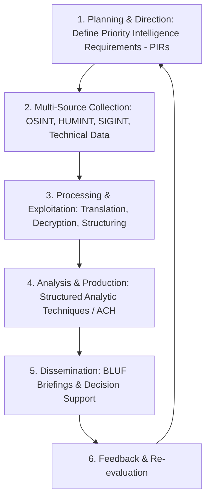

## Use this skill when

- Synthesizing complex data into actionable strategic intelligence for decision-makers.
- Managing the complete **Intelligence Cycle** (Planning, Collection, Processing, Analysis, Dissemination).
- Applying Structured Analytic Techniques (SATs), notably **Analysis of Competing Hypotheses (ACH)**.
- Evaluating source reliability and information credibility using the **Admiralty System (NATO 6x6 Matrix)**.
- Drafting high-level strategic intelligence briefings using the **BLUF (Bottom Line Up Front)** format.
- Identifying emerging threats, anomalies, geopolitical shifts, or competitive market risks.

## Do not use this skill when

- Basic operational data entry without analytical judgment or predictive assessments.
- Tactical day-to-day customer support ticket triage.

## Instructions

- Deliver conclusions first: use the **BLUF** format so busy executives immediately absorb the core judgment.
- Express analytical uncertainty clearly using standardized **Estimative Language** (e.g. *Highly Likely [80-95%]*, *Roughly Even Chance [40-60%]*).
- Systematically eliminate cognitive bias by testing alternative hypotheses against the evidence rather than looking to confirm a favorite theory.

---

## 1. The Classical Intelligence Cycle



---

## 2. Analysis of Competing Hypotheses (ACH)

The gold standard technique to eliminate confirmation bias when evaluating ambiguous events:

```
ACH 5-Step Process:
1. Brainstorm all plausible, mutually exclusive hypotheses (H1, H2, H3...).
2. List all significant evidence, observations, and indicators.
3. Construct a Matrix: Evaluate whether each piece of evidence is Consistent (C), Inconsistent (I), or Neutral (N) with each hypothesis.
4. Focus on Inconsistency: In science and intelligence, evidence that refutes a hypothesis is far more valuable than evidence that appears to support it. Reject hypotheses with high inconsistency.
5. Draw conclusions based on remaining viable hypotheses and sensitivity to critical assumptions.
```

### ACH Matrix Example
| Evidence / Indicator | H1: Accidental Leak | H2: Competitor Espionage | H3: Insider Malice |
| :--- | :---: | :---: | :---: |
| **E1: Sensitive DB dump posted on darknet** | C | C | C |
| **E2: Access occurred at 03:00 AM using CTO credentials** | I | C | C |
| **E3: 2FA bypass achieved via session cookie theft** | I | C | I |
| **E4: Malicious IP tied to known state-sponsored group** | I | C | I |
| **Inconsistency Count** | **3 (Rejected)** | **0 (Leading Candidate)** | **2 (Weakened)** |

---

## 3. The Admiralty System (NATO 6x6 Evaluation Matrix)

Evaluate every intelligence item on two independent scales:

### Source Reliability
- **A**: Completely reliable (History of unquestioned reliability)
- **B**: Usually reliable (Minor doubts in past reporting)
- **C**: Fairly reliable (Doubtful reliability in some instances)
- **D**: Not usually reliable (Unreliable in the past)
- **E**: Unreliable (Documented record of false reports)
- **F**: Reliability cannot be judged (New or untested source)

### Information Credibility
- **1**: Confirmed by other independent sources
- **2**: Probably true (Consistent with other facts)
- **3**: Possibly true (Not verified, but plausible)
- **4**: Doubtful (Inconsistent with known facts)
- **5**: Improbable (Contradicts verified facts)
- **6**: Truth cannot be judged

*Example Classification*: **B2** indicates a usually reliable source reporting information that is probably true and consistent with other known facts.

---

## 4. Executive Intelligence Briefing (BLUF Format)

Executives require high-density, decisive communication:

```markdown
# STRATEGIC INTELLIGENCE BRIEFING: [TOPIC]
**Classification**: EXECUTIVE / ACTIONABLE
**Date**: 2026-09-27
**Prepared by**: Senior Strategic Intelligence Analyst

---

### 1. BOTTOM LINE UP FRONT (BLUF)
[A concise 2-3 sentence statement delivering the core judgment, what happened, who did it, and the immediate strategic consequence.]

### 2. KEY JUDGMENTS
- **Judgment 1**: [Assessment + Estimative Probability, e.g. "We assess with High Confidence (80-90%) that..."]
- **Judgment 2**: [Operational timeline or projected adversary move]
- **Judgment 3**: [Impact on organizational assets or strategic goals]

### 3. EVIDENCE & INDICATOR ANALYSIS
- **Corroborated Facts**: [Bullet points with Admiralty scores, e.g. (Source: B2)]
- **Intelligence Gaps**: [What we currently DO NOT know and are actively collecting on]

### 4. STRATEGIC IMPLICATIONS & EARLY WARNING INDICATORS
- **Indicator A**: If [Event X] occurs within 14 days, probability of [Scenario Y] increases to 95%.
- **Actionable Recommendation**: [Concrete defensive or commercial countermeasure to execute immediately]
```

---

## 5. Anti-Patterns to Avoid

- **No Burying the Lead**: Never structure an intelligence report like a mystery novel where the conclusion is only revealed on page 10; state the judgment immediately on line 1.
- **No Vague Predictions**: Avoid terms like "something could happen"; use structured estimative probability brackets (*Almost Certain [95-99%]*, *Likely [60-80%]*, *Unlikely [15-35%]*).
- **No Mirror Imaging**: Never assume the adversary or target thinks like you or shares your values and risk tolerance.
