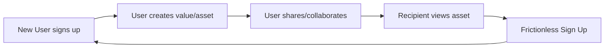

## Use this skill when

- Planning growth strategies for B2B or B2C software, apps, or digital products.
- Designing viral referral programs, sharing mechanics, or user invitation loops.
- Scripting or planning short-form videos (TikTok, Reels, Shorts) targeting maximum reach.
- Building product-led growth (PLG) hooks inside product UX (collaborative features, watermarks, shared links).
- Optimizing organic growth loops, social media campaigns, or community-driven growth tactics.

## Do not use this skill when

- Optimizing direct search marketing or search engine optimization (use `seo-content-writer` or `seo-structure-architect`).
- Setting up paid media campaigns or buying traffic (use `digital-marketing-paid-media`).

## Instructions

- Always analyze the K-Factor ($K = i \times c$) to design sustainable viral growth.
- Use high-tension hook formulas to capture and maintain viewer attention.
- Build loop mechanics directly into the user experience rather than relying on external sharing buttons.

---

## 1. Quantitative Virality & Growth Loops

Viral growth is modeled mathematically. Focus on building loops where a user action leads to more users:

$$K = i \times c$$

- Where $K$ is the **Viral Coefficient**.
- $i$ is the number of invitations sent per active user.
- $c$ is the conversion rate of each invitation.
- **Rule**: If $K > 1$, growth is exponential. If $K < 1$, growth will decay and die out without paid/external acquisition.

### Types of Viral Loops
1. **Word-of-Mouth Virality**: Driven by high product satisfaction. Non-systematic but highly valuable.
2. **Incentivized Virality (Referrals)**: Users invite friends in exchange for value (e.g., Dropbox giving extra storage, PayPal giving cash). double-sided incentives (rewarding both referrer and referee) perform best.
3. **Organic/Product Virality**: Using the product naturally invites others (e.g., Slack team invites, Zoom meeting links, DocuSign signing requests).
4. **Content Virality**: Users share content created inside the app (e.g., TikTok watermark, Canva shared design links, Spotify wrapped cards).

---

## 2. Short-Form Video Virality (TikTok, Instagram Reels, YouTube Shorts)

To bypass algorithm filters and go viral organically, optimize for retention and engagement metrics:

### High-Tension Hook Formulas (0:00 - 0:03)
- **The Visual Hook**: Start in the middle of the action, or show a bizarre/intriguing situation before explaining it.
- **The Text Overlay**: Use bold, high-contrast subtitles with dynamic colors (yellow/white). E.g., *"This simple tool feels illegal to know..."*, *"Why everything you know about X is a lie"*, *"Stop doing X, do this instead."*
- **The Controversy**: State a highly polarizing or counter-intuitive opinion.

### Algorithmic Retention Optimization
- **The Perfect Loop**: Cut the end of the video mid-sentence and start the beginning with the completion of that sentence. This causes viewers to watch the beginning twice, inflating watch-time metrics beyond 100%.
- **High-Velocity Cuts**: Remove all breathing pauses. Use fast-paced jump cuts, zooms, and sound effects (pop, whoosh) every 2-3 seconds.
- **Comment Baiting**: Insert a minor, harmless mistake (spelling error, mispronunciation) or ask a polarizing question at the end. Viewers will flood the comments section to correct you, boosting algorithm visibility.

---

## 3. Product-Led Growth (PLG) Hook Design

Embed viral growth loops directly into the core product experience:

### UX Design Guidelines
- **Collaborative Invites**: Make inviting team members/friends a core part of the onboarding experience (e.g. Figma team workspaces, Notion collaboration).
- **Frictionless Invites**: Allow users to share links that do not require recipients to create an account immediately to view (reduces bounce rate).
- **Branded Signatures**: Add a subtle, premium signature to shared exports (e.g. "Made with Canva", "Sent via Superhuman").
- **Double-Sided Milestone Rewards**: Trigger rewards automatically when both users reach a certain milestone, reinforcing the loop.

---

## 4. Viral Campaign Playbook

When launching a growth hacking campaign, follow these steps:

1. **Find the Hook**: Identify a unique, controversial, or highly-desirable angle.
2. **Remove Friction**: Make the viral action (sharing, inviting, viewing) require as few clicks as possible.
3. **Inject Social Currency**: Give users a reason to share that makes them look smart, wealthy, or funny (e.g. Wordle sharing grids).
4. **Deploy Urgency & Scarcity**: Use limited access codes or expiring invites to build exclusivity (e.g. Clubhouse invite-only launch strategy).
5. **Measure and Iterate**: Calculate $K$-factor and average loop cycle time (time from invite sent to new user sign-up). Optimize the bottleneck.
