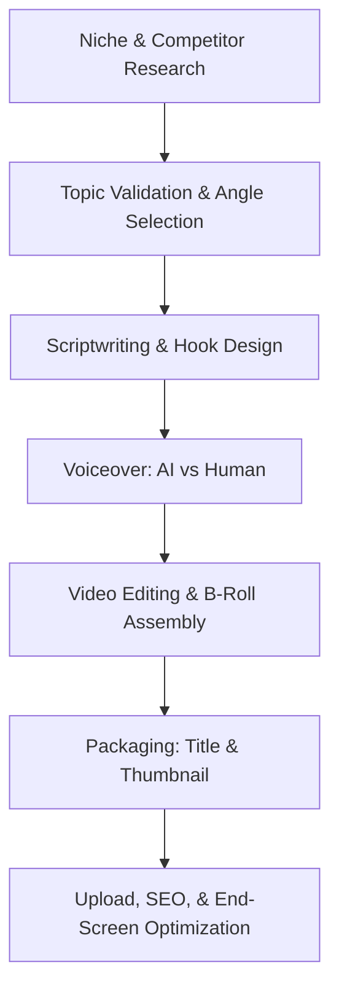

## Use this skill when

- Designing YouTube content strategies, content pipelines, or channel monetization plans.
- Writing video scripts, outlines, hooks, or video description metadata.
- Designing or advising on thumbnail concepts, title combinations, and CTR optimization.
- Developing processes for YouTube automation (faceless channels), voiceover workflows, editing guidelines, and tool stacks.
- Analyzing YouTube metrics (CTR, AVD, traffic sources, impressions) to troubleshoot video performance.

## Do not use this skill when

- The task is general copywriting not intended for video platforms.
- You are optimizing search ads or paid video ads (use `digital-marketing-paid-media` instead).
- General social media management not related to video growth.

## Instructions

- Emphasize viewer retention and Click-Through Rate (CTR) above all else.
- Keep scripts highly engaging, avoiding generic intros like "Welcome back to my channel".
- Implement systematic processes for producing high-quality faceless video pipelines.

---

## 1. Video Scriptwriting & Retention Blueprint

To maximize **Average View Duration (AVD)**, structure scripts using the following structure:

### The Hook (0:00 - 0:30)
- **Immediate payoff**: Do not waste time with generic channel intros, theme songs, or self-introductions.
- **Visual & Verbal match**: Ensure the first sentence directly addresses the promise of the title and thumbnail.
- **The "Curiosity Loop"**: Establish a compelling question or highlight a high-stakes outcome that will only be resolved at the end.

### The Story/Setup (0:30 - 2:00)
- **Raise the stakes**: Explain why the topic matters, the conflict, or what the viewer stands to lose if they click away.
- **Visual pacing**: Plan a visual change (b-roll, zoom, motion graphic) or a "pattern interrupt" every 8-12 seconds.

### High-Density Value Delivery (2:00 - End-5% of video)
- **High-Density Info**: Avoid fluff. Every paragraph must either deliver value, advance the story, or present a new twist.
- **Pattern Interrupts**: Use sound effects (swoosh, pop), text overlays, zooms, and resets of framing.
- **Micro-Hooks**: Keep viewers hooked by saying: *"But here's where it gets weird..."* or *"Most people get this next part completely wrong..."*

### The Seamless Outro (Last 5% of video)
- **NEVER say closing words**: Do not say *"In conclusion"*, *"That's all for today"*, or *"Thanks for watching"*. This triggers immediate viewer drop-off.
- **The End-Screen Bridge**: Pitch the next video on the end screen as a direct, logical continuation of the current topic. *"If you want to know how X actually did Y, click on this video right here where we break it down."*

---

## 2. Click-Through Rate (CTR) & Packaging Psychology

A video's packaging is the Title + Thumbnail combination. They must work together:

### Thumbnail Principles
- **The 3-Element Rule**: A thumbnail should contain at most 3 visual elements: a clear focal point (face/object), an emotional trigger, and optionally minimal text (maximum 3 words, different from the title).
- **Contrast & Clutter-free**: High contrast, vibrant colors (avoid gray/muddy tones), and clear outlines. Ensure readability on small mobile screens.
- **Emotional Trigger**: Use expressive faces displaying extreme emotion (surprise, anger, fear, curiosity) or intriguing visual anomalies (e.g. before/after, zoomed-in mysteries).

### Title Formulas
- **Curiosity Gap**: *"The Secret Reason Behind..."*, *"Why X Stopped Doing Y"*
- **Negativity/Fear of Missing Out**: *"Avoid This Critical Mistake..."*, *"Why Your X is Ruining Your Y"*
- **Juxtaposition/Irony**: *"I Bought the Cheapest X and..."*, *"How this 12-Year-Old Made $10,000"*
- **Character Count**: Keep titles under 50 characters to prevent truncation on mobile devices.

---

## 3. YouTube Automation (Faceless Channels) Pipeline

Build a scalable content factory by separating the workflow into specialized micro-steps:

### Automation Guidelines
1. **Topic Validation**: Research competitors' videos that have outperformed their subscriber count (outlier videos). Use these topics as validation.
2. **Scripting**: Strictly follow the retention blueprint.
3. **Voiceover**: Use high-quality AI speech synthesis (e.g., ElevenLabs) or hire specialized voice actors. Avoid robotic, monotonic voices.
4. **Editing**: Fast-paced style, zooming every 3-5 seconds, sound effects, subtitles, and high-quality b-roll/animations.
5. **SEO & Metadata**: Focus on optimizing descriptions for browse features (suggested videos) by using relevant keywords naturally in the first 3 sentences.

---

## 4. Troubleshooting & Analytics Optimization

Diagnose underperforming videos using YouTube Studio analytics:

- **Low CTR (< 4%)**: Change the thumbnail first. If impressions do not pick up, change the title angle. Check mobile device preview rendering.
- **Sharp drop in first 30 seconds (> 40% loss)**: The hook failed to match the expectation set by the title/thumbnail, or the intro was too slow/cluttered. Rewrite the hook next time.
- **Low retention/flat decline**: The pacing is too slow. Increase b-roll density, reduce silence gap (jump-cut edits), and add pattern interrupts.
- **High click-off during transitions**: The transition was too slow or signaled a conclusion. Keep transitions active and forward-looking.
